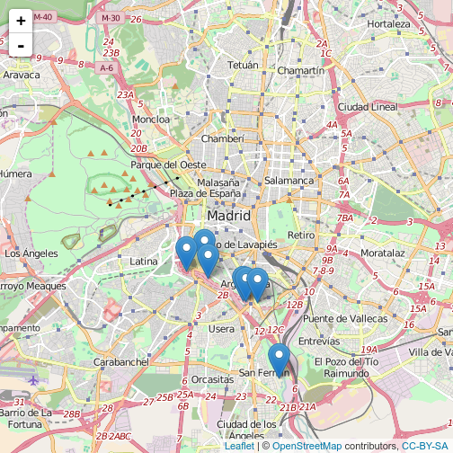

```r
# Librerías requeridas
library(RCurl)
library(rmarkdown)
library(yaml)

# URL de la hoja de cálculo con los datos
url.data <- "https://docs.google.com/spreadsheets/d/1zda2z0b09o-XUY-RdOWpcKgg-tbgn3d3syDijnKtX4s/pub?gid=176454935&single=true&output=csv"
# Carga de los datos
data <- read.csv(text = getURL(url.data, .encoding = "UTF-8"), encoding = "UTF-8", header = T, stringsAsFactors = F)
# Añadir € al campo de Importe
data[,6] <- paste(format(data[,6], big.mark="."), "€")
```

```
## Warning in prettyNum(.Internal(format(x, trim, digits, nsmall, width, 3L, :
## 'big.mark' and 'decimal.mark' are both '.', which could be confusing
```

```r
# Función que obiene el nombre normalizado para una ficha. 
getName <- function (x) {
  name <- gsub(" ", "-", tolower(iconv(x, to='ASCII//TRANSLIT')))
  name <- gsub("/", "-", name)
  return(name)
}
```


```r
# Escribir la lista de ilegitimidades
cat(unlist(lapply(data[,2], function(x) paste("- [", x, "](", getName(x), ".html)\n", sep=""))))
```

- [Soterramiento de la M-30](soterramiento-de-la-m-30.html)
 - [Caja Mágica](caja-magica.html)
 - [Puente Monumental Perrault](puente-monumental-perrault.html)
 - [Operación Mahou-Calderón](operacion-mahou-calderon.html)
 - [Mercado de Frutas y Verduras de Legazpi](mercado-de-frutas-y-verduras-de-legazpi.html)
 - [Oficina de Atención al Contribuyente](oficina-de-atencion-al-contribuyente.html)
 - [Matadero de Madrid](matadero-de-madrid.html)
 - [Servicio de guías culturales](servicio-de-guias-culturales.html)

## Mapa de gastos presuntamente ilegítimos


```r
baseurl <- "http://pacd-madrid.github.io/fichas-ilegitimidad/"
# Transformación de las url de las fotos para tomarlas del catálogo en github
getUrlPhoto <- function (x) {
  name <- ""
  if (x[20]!="") {
    name <- paste(baseurl, "img/", getName(x[2]), "-small-1.jpg", sep="")
  }
  return(name)
}
data[["Fotos"]] <- apply(data, 1, getUrlPhoto)
data[["Popup"]] <- paste("<h3><a href=\"", baseurl, getName(data[["Título"]]), ".html\">", data[["Título"]], "</a></h3>\n\n\n\n<p>", data[["Importe"]], "</p>", sep="")
# Separar las coordenadas en longitud y latitud
require(tidyr)
data <- separate(data = data, col = Ubicación, into = c("lat", "lng"), sep = "\\,")
```

```
## Warning: Too few values at 1 locations: 8
```

```r
require(leaflet)
m <- leaflet(data = data) %>%
  setView(lng=-3.70453, lat=40.41358, zoom = 12) %>%
  addTiles() %>%
  addMarkers(popup=~Popup)
```

```
## Assuming 'lng' and 'lat' are longitude and latitude, respectively
```

```r
m
```



