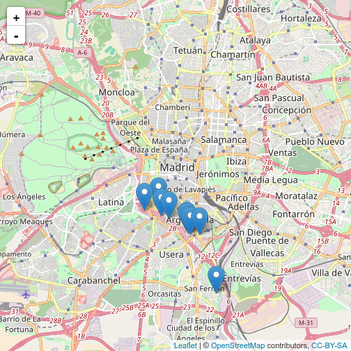

- [Soterramiento de la M-30](soterramiento-de-la-m-30.html)
 - [Caja Mágica](caja-magica.html)
 - [Puente Monumental Perrault](puente-monumental-perrault.html)
 - [Operación Mahou-Calderón](operacion-mahou-calderon.html)
 - [Mercado de Frutas y Verduras de Legazpi](mercado-de-frutas-y-verduras-de-legazpi.html)
 - [Oficina de Atención al Contribuyente](oficina-de-atencion-al-contribuyente.html)
 - [Matadero de Madrid](matadero-de-madrid.html)
 - [Contratos de limpieza de Clece Distrito Arganzuela](contratos-de-limpieza-de-clece-distrito-arganzuela.html)
 - [Contrato de Auxiliares de control Centro Cultural Matadero](contrato-de-auxiliares-de-control-centro-cultural-matadero.html)
 - [Pago doble del agua por parte de parques y jardines](pago-doble-del-agua-por-parte-de-parques-y-jardines.html)

## Mapa de gastos presuntamente ilegítimos

