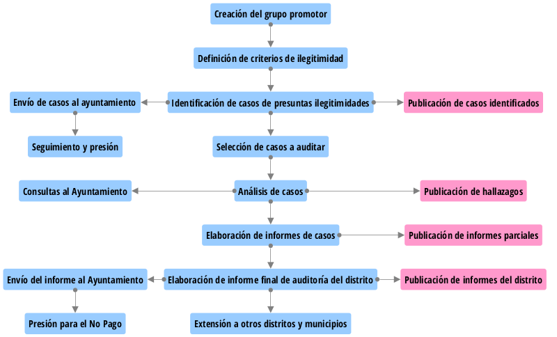
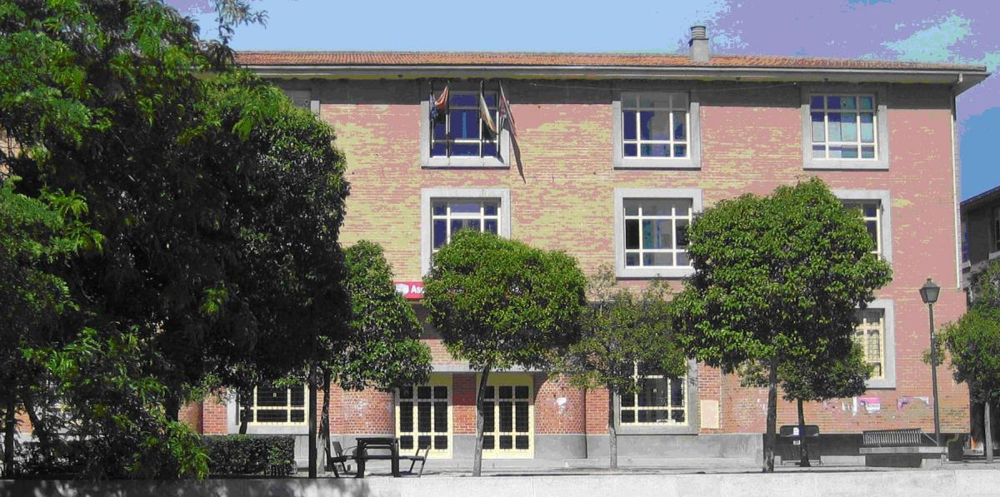
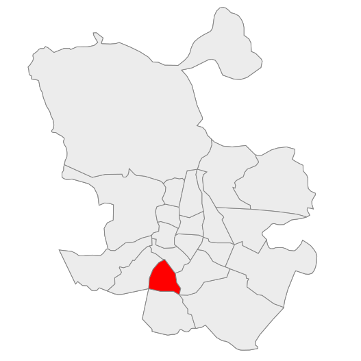

```{r setup, include=FALSE}
knitr::opts_chunk$set(echo=F, cache=F, prompt=F, tidy=T, comment=NA, message=F, warning=F)
```

```{r}
library(plotly)
library(dplyr)
```

[Resumen Ejecutivo del Informe](Resumen_Ejecutivo_Centros_Culturales_Usera.html)

# Introducción

Desde el inicio de la crisis en 2008 hemos comprobado cómo la Deuda se ha convertido en la gran excusa para aplicar las políticas de recortes en el gasto social y en el principal instrumento de sometimiento de las poblaciones a los dictados del capital. En este tiempo gran parte de la clase política, tanto de los gobiernos nacionales, autonómicos como municipales, ha mentido descaradamente a la población sobre cuál es el verdadero origen de la crisis y se han empeñado en aplicar políticas erradas que no sólo no actúan sobre la raíz del problema, sino que benefician a los responsables, mientras perjudican al conjunto de la ciudadanía.

El Ayuntamiento de Madrid no es una excepción, más bien al contrario, ya que es el ayuntamiento más endeudado del Estado español. Su deuda, según el Protocolo de Déficit Excesivo (PDE), es de casi 4.471 millones de euros (casi 1.500 € por habitante). Este endeudamiento se debe, sobre todo, al periodo de gobierno de Gallardón, en el que la deuda pasó de los 1.455 millones de euros de 2003 hasta alcanzar el pico de los 7.757 millones de euros del primer semestre de 2011 según el Banco de España[^nota1], y eso sin contar la deuda a corto plazo con proveedores.

[^nota1]: http://www.bde.es/webbde/es/estadis/infoest/a1408.pdf

```{r deuda-madrid, fig.width=8, fig.align="center", fig.cap="_Figura 1. Evolución de la deuda del Ayuntamiento de Madrid.<br>Fuente: Elaboración propia a partir de los datos del Banco de España._"}
require(plotly)
data = read.table("datos/deuda_ayuntamiento_madrid.csv", header = TRUE, sep=",")
p <- plot_ly(data, x=~Año, y=~Deuda, type='bar', color=~Alcalde) %>%
  layout(title="Evolución de la deuda del Ayuntamiento de Madrid", yaxis = list(title="Deuda (en millones de €)"), legend = list(y=100, orientation = 'h'), margin=list(t=90))
p
```

Este período se caracterizó por un despilfarro sin precedentes en la capital madrileña, en la que se construyeron multitud de infraestructuras, como el soterramiento de la M-30 (que se estima supuso más de 4.000 millones de euros), la compra y remodelación del Palacio de Cibeles (que supuso más de 500 millones de euros), las inversiones para las olimpiadas, y otros gastos de dudoso beneficio para la población madrileña.

Como consecuencia de este sobreendeudamiento y a raíz de la reforma del artículo 135 de la Constitución, que antepone el pago de la deuda al gasto social, desde 2013 el Ayuntamiento de Madrid se ha visto obligado a aplicar enormes recortes en el gasto público para poder hacer frente al pago de la deuda.

Ante esta agresión a la soberanía y los derechos ciudadanos, y aprovechando que el actual gobierno de Ahora Madrid contempla en su programa electoral la realización de una Auditoría de la Deuda, la población madrileña se ha organizado para exigir al Ayuntamiento de Madrid el cumplimiento de sus promesas electorales y que además la Auditoría sea **Ciudadana**, es decir, que cuente con una amplia participación de la población madrileña ya que la ciudadanía es la única soberana para decidir sobre la legitimidad o ilegitimidad de un gasto o ingreso ejecutado en su territorio. Con tal fin se han constituido grupos auditores en varios distritos de Madrid, y en particular en el distrito de Arganzuela al que afecta el caso de este informe.

## ¿Qué es la Auditoría Ciudadana?

La Auditoría Ciudadana de la Deuda y la Gestión de las Cuentas Públicas es una iniciativa ciudadana que pretende el empoderamiento de la población mediante la realización de una auditoría integral de las cuentas y las políticas de las Administraciones Públicas.

Los principales objetivos de la Auditoría Ciudadana son: 	 	

* Constituir una herramienta de información, sensibilización, formación y participación de las ciudadanas y los ciudadanos en relación al control de la gestión de los recursos públicos y el impacto de la deuda del Ayuntamiento de Madrid.

* Ser una herramienta que permita mejorar la transparencia en la gestión de los recursos públicos, procesos de rendición de cuentas, así como el aumento en la eficiencia y eficacia de la gestión del Ayuntamiento de Madrid.

* Proveer de argumentos y herramientas al gobierno municipal para la suspensión o anulación de la deuda identificada como ilegal y/o ilegítima (aquella deuda que ahoga y recorta nuestros derechos), en una eventual negociación con los acreedores, así como para la exigencia de responsabilidades administrativas, civiles y penales de las personas participantes en su gestación. 	

* Generar los mecanismos necesarios para evitar nuevos procesos de 	endeudamiento pernicioso.

Hay que señalar que no se trata de una auditoría contable al uso, y que no sólo se auditarán los aspectos económicos, sino también los sociales, laborales, medioambientales y de género.

## El concepto de ilegitimidad

La Auditoría Ciudadana pivota en torno al concepto de **ilegitimidad**, que no es un concepto jurídico, sino político, que va más allá de la ilegalidad. Porque la historia demuestra que ha habido leyes injustas que han permitido la esclavitud o han impedido el voto de las mujeres, puede haber gastos o ingresos, y las deudas derivadas de estos, que se atengan a la legalidad vigente pero que atenten contra los derechos básicos de las personas.

A efectos de este informe entendemos por **Deuda Ilegítima** aquella contraída sin contar con la población y que vulnera derechos humanos, sociales, civiles, económicos, culturales, medioambientales o de género de una parte de la población en favor de los intereses de una minoría.

# Metodología

El proceso de Auditoría Ciudadana del distrito de Arganzuela ha seguido la metodología descrita en la figura 2.



_Figura 2. Fases de la Auditoría Ciudadana._

Tras la constitución del grupo auditor y la definición de los criterios utilizados para declarar un gasto o ingreso como ilegítimo, el proceso básicamente consta de las siguientes fases:

1. **Identificación de los casos de presuntos gastos o ingresos ilegítimos** en el distrito. Para ello se ha utilizado un modelo de ficha que identifica las presuntas ilegitimidades acometidas en cada caso.
La ficha correspondiente a este caso puede consultarse en:
[http://pacd-madrid.github.io/fichas-ilegitimidad/Oficina-de-Atenci%C3%B3n-al-Contribuyente.html](http://pacd-madrid.github.io/fichas-ilegitimidad/Oficina-de-Atenci%C3%B3n-al-Contribuyente.html)

2. **Selección de los casos auditar** por el grupo auditor. En esta fase el grupo auditor prioriza los casos a investigar y decide en qué orden investigarlos.

3. **Análisis de los casos**. En esta fase, la más larga del proceso, se investiga el caso seleccionado en la etapa anterior. El objetivo de esta fase es aportar las pruebas que confirmen o refuten los indicios de ilegitimidad señalados en la primera fase. Para ello el grupo auditor formulará consultas al Ayuntamiento, la junta de distrito, empresas subcontratadas y recolectará información de otros medios sobre aspectos relacionados con el caso a auditar. La información recopilada se analizará a la luz de los criterios de ilegitimidad establecidos para determinar la legitimidad o ilegitimidad del caso.

4. **Elaboración del informe de caso**. Una vez analizadas las pruebas se realizará un informe como el presente para cada caso auditado donde se presentará de forma clara las pruebas analizadas y las conclusiones sobre la legitimidad o ilegitimidad del caso.

5. **Elaboración del informe final del distrito**. Con todos los informes de los casos auditados se elaborará un informe final de auditoría del distrito que se trasladará al Ayuntamiento de Madrid para exigir el reconocimiento institucional de los casos declarados como ilegítimos y el no pago de la deuda generada por los mismos, así como el emprendimiento de acciones legales contra los principales responsables de los mismos.  

# Descripción del caso auditado

El presente informe presenta los resultados de la auditoría ciudadana de los **Cursos y Talleres de Formación Talleres de Formación en los Centros Culturales
de Usera**. En el distrito de Usera se encuentran seis Centros Culturales que se indican a continuación:

- Centro Cultural Juvenil Usera
- Centro Cultural Meseta de Orcasitas
- Centro Cultural Orcasur
- Centro Cultural San Fermín
- Centro Cultural Usera I y II.
- Centro Sociocultural Cánovas del Castillo

{.img-center}

<p class="caption">
_Figura 3. Centro cultural la Meseta de Orcasitas._
</p>

```{r map, fig.height=4, fig.align="center", fig.cap="_Figura 4. Ubicación de los centros culturales del distrito de Usera._"}
require(leaflet)
m <- leaflet() %>%
  setView(lng=-3.70453, lat=40.41358, zoom = 12) %>%
  addTiles() %>%
  addMarkers(lat=40.3898658, lng=-3.7096479, popup="Centro cultural juvenil Usera") %>%
  addMarkers(lat=40.3693578, lng=-3.7105596, popup="Centro cultural Mestea de Orcasistas") %>%
  addMarkers(lat=40.3727159, lng=-3.7157533, popup="Centro cultural Orcasur") %>%
  addMarkers(lat=40.3714772, lng=-3.6942552, popup="Centro cultural San Fermín") %>%
  addMarkers(lat=40.3792723, lng=-3.7137027, popup="Centro cultural Usera I y II") %>%
  addMarkers(lat=40.3863825, lng=-3.7024582, popup="Centro sociocultural Cánovas del Castillo")
m
```
<br>
En esta auditoría se ha tratado de analizar los impactos socio-culturales, laborales, económicos y de género en las subcontratas que se han llevado a cabo en el período 2015-2016 y que han podido tener un efecto lesivo en la ciudadanía, beneficiado fundamentalmente a las empresas adjudicatarias.

## Duración del análisis

El periodo auditado para el caso correspondiente al presente informe comprende los ejercicios de 2015 y 2016.

## Fuentes de información

Las fuentes de información utilizadas en la auditoría del presente caso han sido:

- [Presupuestos Municipales de Madrid](http://datos.madrid.es/portal/site/egob/menuitem.c05c1f754a33a9fbe4b2e4b284f1a5a0/?vgnextoid=af62db13cb659410VgnVCM1000000b205a0aRCRD&vgnextchannel=374512b9ace9f310VgnVCM100000171f5a0aRCRD).

- [Portal de Transparencia del Ayuntamiento de Madrid](http://transparencia.madrid.es/).

- [Subdirección General de Auditoría de la Deuda y Políticas Públicas del Ayuntamiento de Madrid](http://www.madrid.es/portales/munimadrid/es/Inicio/Actividad-economica-y-hacienda/Hacienda/Auditoria-de-la-deuda-y-las-politicas-publicas?vgnextfmt=default&vgnextoid=b94edfac1d56a510VgnVCM1000001d4a900aRCRD&vgnextchannel=e51b6d5ef88fe410VgnVCM1000000b205a0aRCRD).

- [Perfil del contratante del Ayuntamiento de Madrid](https://sede.madrid.es/portal/site/tramites/menuitem.042d661afe5adaf7cf32e4e5a8a409a0/?vgnextoid=8afd814231ede410VgnVCM1000000b205a0aRCRD&vgnextchannel=8afd814231ede410VgnVCM1000000b205a0aRCRD&vgnextfmt=default).

- [Ayuntamiento de Madrid – Subdirección General de Estadística](http://www.madrid.es/portales/munimadrid/es/Inicio/El-Ayuntamiento/Estadistica/Sudireccion-General-de-Estadistica?vgnextfmt=default&vgnextoid=d7f11e79ee71c010VgnVCM1000000b205a0aRCRD&vgnextchannel=8156e39873674210VgnVCM1000000b205a0aRCRD).

- [Memoria de cumplimiento de objetivos 2014 y 2015 del Ayuntamiento de Madrid](http://www.madrid.es/portales/munimadrid/es/Inicio/Ayuntamiento/Hacienda/Informacion-financiera-y-presupuestaria/Presupuestos/Ejecucion-presupuestaria/Memorias-de-cumplimiento-de-objetivos?vgnextfmt=default&vgnextchannel=2f78c1258a2f8210VgnVCM2000000c205a0aRCRD).

- [Registro Mercantil](http://www.rmc.es/).

- Junta del distrito de Usera.

- Reuniones con la Concejal-Presidenta de la Junta del distrito de Usera y con el Departamento Jurídico del distrito de Usera.

Al amparo de la Ley 19/2013, de 9 de diciembre, de transparencia, acceso a la información pública y buen gobierno y de la Nueva Ordenanza de Transparencia de la Ciudad de Madrid aprobada en Pleno del día 27 de julio de 2016, se formularon las siguientes peticiones de información al Ayuntamiento:

* [Petición 2016/1148632](https://pacd-madrid.github.io/peticiones-informacion/peticion-2016-1148632.html). Contratos formalizados con VIRENSIS SA para el curso 2014-2015 y AULA INTERCULTURAL SL para el curso 2015-2016.
* [Petición 2016/1148770 ](https://pacd-madrid.github.io/peticiones-informacion/peticion-2016-1148770.html). Ofertas presentadas en el concurso de licitación para los talleres de formación de los centros culturales de Usera.
* [Petición 2016/1148844](https://pacd-madrid.github.io/peticiones-informacion/peticion-2016-1148844.html). Facturación total realizada por la empresa AULA INTERCULTURAL SL correspondiente al curso 2015-2016.
* [Petición 2016/1149024](https://pacd-madrid.github.io/peticiones-informacion/peticion-2016-1149024.html). Número de personas asistentes a los cursos y talleres impartidos en los centros culturales de Usera desglosado por sexo.
* [Petición 2016/1155108](https://pacd-madrid.github.io/peticiones-informacion/peticion-2016-1155108.html). Memoria de ejecución del contrato presentada por la empresa adjudicataria a la finalización del curso.
* [Petición 2016/1155112](https://pacd-madrid.github.io/peticiones-informacion/peticion-2016-1155112.html). Presupuesto inicial y presupuesto liquidado del gasto correspondiente a los talleres de formación en los centros culturales de Usera en el periodo 2010-2016.
* [Petición 2016/1165113](https://pacd-madrid.github.io/peticiones-informacion/peticion-2016-1165113.html). Información sobre alumnos matriculados, cursos programados e impartidos, horas contratadas, materias programadas, salarios de profesores y coste por hora facturado a la empresa adjudicataria en el periodo 2010-2016.
* [Petición 2016/1226198](https://pacd-madrid.github.io/peticiones-informacion/peticion-2016-1226198.html). Coste por hora facturado a la empresa VIRENSIS SA para el curso 2014-2015 y AULA INTERCULTURAL SL, para el curso 2015-2016.
* [Petición 2016/1226291.html](https://pacd-madrid.github.io/peticiones-informacion/peticion-2016-1226291.html). Verificaciones realizadas por el coordinador cultural: relación de clases impartidas, número de alumnos asistentes e incidencias en los cursos 2014-2015 y 2015-2016.


# Datos sociológicos del Distrito de Usera



## Problemática social

Situado en la parte sur de la capital, junto a Villaverde, Carabanchel y Arganzuela, este distrito se configuró a partir del asentamiento de familias humildes y trabajadoras, procedentes de otros lugares de España en busca de un futuro mejor.

Se pueden distinguir dos zonas en el distrito, una zona "norte" que ocuparon familias trabajadoras en viviendas modestas; y una zona sur objeto de actuaciones como Orcasitas, Orcasur y San Fermín, donde se construyeron viviendas sociales para alojar a las familias chabolistas de la zona. Es en este último núcleo donde se concentró sobre todo una fuerte problemática social con desempleo elevado, fracaso escolar y pobreza.

También en Usera han existido importantes núcleos de marginación social y venta de drogas como el Rancho del Cordobés y Torregrosa, ya desmantelados.

En los últimos años, el paisaje residencial y social de Usera ha experimentado cambios con la construcción de viviendas nuevas en las que predominan familias de clase media. No obstante, el distrito sigue presentando una de las rentas per cápita anual más bajas de Madrid (16.122 euros en 2013), muy por debajo de la media de la capital (20.639 euros).

Este dato ilustra las principales problemáticas a las que se enfrentan sus vecinos: el desempleo, la precariedad laboral, la insuficiencia de recursos, un cierto nivel de absentismo y fracaso escolar que tiene como consecuencia una baja cualificación entre los jóvenes.

En el distrito hay un tejido asociativo muy fuerte, principalmente centrado en las Asociaciones de Vecinos (AAVV), 15M, movimientos sociales, muy activas en la reivindicación de soluciones a las problemáticas sociales referidas al principio.

En estos últimos años, las AAVV y los movimientos sociales han incorporado a su trabajo la realidad multicultural de su entorno, a través de intervenciones específicas (deportes, apoyo escolar...).

Poco a poco las asociaciones de inmigrantes intentan arraigar en el distrito. En general, la población autóctona del distrito está sensibilizada con la nueva realidad, aunque se perciben ciertas tensiones ligadas sobre todo al parque de Pradolongo, especialmente a raíz de algunos conflictos que surgieron con la venta de comida y bebidas alcohólicas, los ruidos, acumulación de basura, etc.

Es importante destacar el alto nivel de coordinación y de trabajo conjunto que desde hace años existe entre las asociaciones y entidades del distrito, lo que debe ser un aspecto positivo y potenciador en la articulación de la convivencia entre todos los vecinos.

##  Perfil demográfico del Distrito de Usera

La población a 1 de enero de 2016, era de 134.015 habitantes.
El 25,16% corresponde a la población de 65 años y más. La evolución de la población en el período 2005-2016 es la que se puede ver en la figura 5.

```{r evolucion-poblacion-usera, fig.width=8, fig.align="center", fig.cap="_Figura 5. Evolución de la población del distrito de Usera.<br>Fuente: Elaboración propia a partir de los datos del Ayuntamiento de Madrid._"}
require(plotly)
data = read.table("datos/evolucion_poblacion_usera.csv", header = TRUE, sep=",")
p <- plot_ly(data, x=~Año, y=~Población.Total, type="scatter", mode="lines+markers", name="Total", hoverinfo = 'text', text = ~paste('Año: ', Año, '</br>Personas: ', format(Población.Total, decimal.mark=",", big.mark="."))) %>%
  add_trace(x =~Año, y=~Mujeres, type="bar", name="Mujeres", hoverinfo = 'text', text = ~paste('Año: ', Año, '</br>Personas: ', format(Mujeres, decimal.mark=",", big.mark="."))) %>%
  add_trace(x =~Año, y=~Hombres, type="bar", name="Hombres", hoverinfo = 'text', text = ~paste('Año: ', Año, '</br>Personas: ', format(Hombres, decimal.mark=",", big.mark="."))) %>%
  layout(title = "Evolución de la población del distrito de Usera", yaxis = list(title="Número de personas", tickformat=",s"), margin=list(l=70))
p
```

A 1 de enero de 2016, el perfil demográfico de la población del distrito de Usera se puede ver en la Tabla 1:


| Población Total | Población Española | Población Extranjera |
|:---------------:|:------------------:|:--------------------:|
|     134.015     |      109.446       |        24.566        |

**Población extranjera por sexo**

| Hombres | Mujeres |
|:-------:|:-------:|
| 12.085  | 12.481  |

**Población total por edad**

| Menores de 16 años españoles | Menores de 16 años extranjeros | Mayores de 65 años |
|:----------------------------:|:------------------------------:|:------------------:|
|            21.857            |             3.638              |   24.056 (17,9%)   |

_Tabla 1: Distribución de la población del distrito de Usera.  
Fuente: Ayuntamiento de Madrid. Subdirección General de Estadística._

Con una población cada vez más envejecida la llegada de población inmigrante, que representa el 18,33% de los habitantes (1 de enero de 2016), ha ayudado a rejuvenecer el perfil del distrito. Esta población de origen extranjero vive, sobre todo, aunque no exclusivamente, en las zonas de Pradolongo (28,45%), donde el parque que lleva su mismo nombre fue uno de los primeros lugares de encuentro del colectivo colombiano y Almendrales (24,12%).
En la figura 6 se puede ver la distribución de la población extranjera en el distrito de Usera y el desglose por barrios a 1 de enero de 2016:

```{r distribucion-extranjeros-barrios-usera, fig.width=6, fig.align="center", fig.cap="_Figura 6. Distribución de los extranjeros por barrios de Usera.<br>Fuente: Elaboración propia a partir de los datos del Ayuntamiento de Madrid._"}
require(plotly)
data = read.table("datos/distribucion_extranjeros_barrios_usera.csv", header = TRUE, sep=",")
p <- plot_ly(data, x=~Población.extranjera, y=~reorder(Barrio, Población.extranjera), color=~Color, type="bar", orientation="h", hoverinfo = 'text', text = ~paste(format(Población.extranjera, decimal.mark=","), "%")) %>%
  layout(title = "Distribución de la población extranjera por barrios en Usera", xaxis = list(title="Porcentaje", gridcolor = "#bbb"), yaxis = list(title=""), showlegend = FALSE, margin=list(l=90), showgrid = TRUE, color="#111")
p
```

El distrito tiene desde hace bastantes años una diversidad de orígenes considerable: africanos, latinoamericanos, magrebíes, chinos.... Actualmente la población de origen extranjero más numerosa es la ecuatoriana con una representación del 27,2%, seguido del colombiano con un 13,8%, el chino con un 12,9%, y el boliviano con un 11,3%.

Destaca la importante presencia del colectivo chino, asociado a la disponibilidad de locales asequibles para sus comercios.

A diferencia de Centro, los inmigrantes chinos trabajan, pero también viven en el mismo distrito, sus hijos van, mayoritariamente, a los colegios públicos de Usera, hacen uso de los servicios del distrito, etc. Para este colectivo, una de sus principales dificultades se encuentra en el idioma, siendo en muchos casos una verdadera barrera lingüística en las gestiones administrativas y relaciones sociales.

En los últimos años se ha observado una presencia cada vez mayor de inmigrantes de origen boliviano, que en relación con otros colectivos representa un porcentaje pequeño, pero con voluntad de hacerse visibles y participar en la vida del distrito a través de la constitución de una asociación. Junto a esta población de origen inmigrante más reciente, existe un grupo importante y más antiguo de población de origen marroquí. La llegada de la nueva población ha transformado la composición social del distrito, ya que frente al progresivo envejecimiento de la población autóctona se produce un crecimiento de la población infantil y juvenil de origen extranjero. La figura 7 muestra la evolución de la población total extranjera del distrito de Usera y por sexo.

```{r evolucion-poblacion-extranjera-usera, fig.width=8, fig.align="center", fig.cap="_Figura 7. Evolución de la población extranjera del distrito de Usera.<br>Fuente: Elaboración propia a partir de los datos del Ayuntamiento de Madrid._"}
require(plotly)
data = read.table("datos/evolucion_extranjeros_usera.csv", header = TRUE, sep=",")
p <- plot_ly(data, x=~Año, y=~Total, type="scatter", mode="lines+markers", name="Total", hoverinfo = 'text', text = ~paste('Año: ', Año, '</br>Personas: ', format(Total, decimal.mark=",", big.mark="."))) %>%
  add_trace(x =~Año, y=~Mujeres, type="bar", name="Mujeres", hoverinfo = 'text', text = ~paste('Año: ', Año, '</br>Personas: ', format(Mujeres, decimal.mark=",", big.mark="."))) %>%
  add_trace(x =~Año, y=~Hombres, type="bar", name="Hombres", hoverinfo = 'text', text = ~paste('Año: ', Año, '</br>Personas: ', format(Hombres, decimal.mark=",", big.mark="."))) %>%
  layout(title = "Evolución de la población del distrito de Usera", yaxis = list(title="Número de personas", tickformat=",s"), margin=list(l=70))
p
```

De la información de la figura 7 se pueden extraer algunas conclusiones:

- A partir del año 2010, tres años después del inicio de la crisis, se produce una progresiva pérdida de población extranjera en el distrito (11.126 habitantes), hasta el año 2015, en el que se inicia una tendencia que se concreta en 2016 con un aumento de 923 habitantes.

- En relación con la distribución de la población por sexo, se observa un cambio en la composición entre hombres y mujeres. Mientras que en el período 2005-2011 la proporción de hombres era mayor que la de mujeres, a partir del año 2012 se produce un progresivo incremento del número de mujeres sobre el de hombres.

- Habría que ver, de manera más pormenorizada, las causas del cambio de tendencia y si la tendencia se va a mantener en los próximos años.

A 1 de enero de 2016 el 19,7% de la población juvenil (menores de 16 años) procede de otros países. El 29,29% del alumnado matriculado en los colegios públicos es de origen extranjero.

## Perfil socioeconómico del Distrito de Usera

En relación con la Renta disponible per cápita, según los últimos datos disponibles de 2013, el distrito de Usera se coloca en los últimos lugares del *ranking* por Distritos. Los tres distritos con mayor Renta Disponible Bruta per cápita son Salamanca (26.344 €), Chamartín (26.100 €) y Chamberí (25.855 €).

Por el contrario, Usera con 16.122 €, Villaverde (15.946 €) y Puente de Vallecas (15.715 €), ocupan los últimos lugares de la lista. En la figura 8 se puede ver la información desglosada por distritos:

```{r renta-distritos, fig.width=6, fig.align="center", fig.cap="_Figura 8. Renta disponible bruta per cápita por distritos en 2013.<br>Fuente: Elaboración propia a partir de los datos del Ayuntamiento de Madrid._"}
require(plotly)
data = read.table("datos/renta_distritos.csv", header = TRUE, sep=",")
p <- plot_ly(data, x=~Renta, y=~reorder(Distrito, Renta), color=~Color, type="bar", orientation="h") %>%
  layout(title = "Renta disponible bruta per cápita por distritos en 2013", xaxis = list(title="Renta en €", gridcolor = "#bbb", tickformat="d"), yaxis = list(title=""), showlegend = FALSE, margin=list(l=130))
p
```

La figura 9 muestra el paro registrado a octubre de 2016 en la ciudad de Madrid por distritos.
Como se puede observar, los distritos con mayor porcentaje de paro registrado son Puente de Vallecas (13,72%), Villaverde (13,55%) y Usera (12,08%), mientras que los distritos con mayor renta disponible son los que tienen menor porcentaje de paro: Chamartín (6,04%), Salamanca (6,10%) y Chamberí (6,31%).
Llama la atención que el paro registrado en los distritos de Vallecas, Villaverde y Usera duplica al de los distritos de Chamartín, Salamanca y Chamberí.

```{r paro-distritos, fig.width=6, fig.align="center", fig.cap="_Figura 9. Paro registrado por distritos en 2013.<br>Fuente: Elaboración propia a partir de los datos del Ayuntamiento de Madrid._"}
require(plotly)
data = read.table("datos/paro_distritos.csv", header = TRUE, sep=",")
p <- plot_ly(data, x=~Paro, y=~reorder(Distrito, Paro), type="bar", color=~Color, orientation="h", hoverinfo="text", text = ~paste(format(Paro, decimal.mark=",", big.mark="."),"%")) %>%
  layout(title = "Paro registrado por distritos en 2013", xaxis = list(title="Porcentaje de paro", gridcolor = "#bbb", tickformat="d"), yaxis = list(title=""), showlegend = FALSE, margin=list(l=130))
p
```


Esta situación coincide con un estudio[^5] reciente llevado a cabo por el Ayuntamiento de Madrid en el que analiza los desequilibrios entre los diferentes distritos de la capital. En el informe se constata las enormes diferencias que existen entre los 21 distritos de la capital.

[^5]: http://www.20minutos.es/noticia/2876265/0/puente-vallecas-villaverde-usera-distritos-capital-desequilibrados/?utm_source=Whatsapp&utm_medium=Social&utm_campaign=Mobile-web

Considerando que un valor de 0 corresponde a la mínima necesidad de reequilibrio y que uno de 100 designa la máxima necesidad, en la parte más alta de este ranking se encuentran Puente de Vallecas (88,69%), Villaverde (86,43%), Usera (78,06%), Vicálvaro (77,68%), Villa de Vallecas (76,79%), Carabanchel (75%) y Latina (66,84%).

La necesidad media de reequilibrio se sitúa en San Blas (57,44%), Tetuán (56,92%), Moratalaz (54,17%), Centro (46,43%), Ciudad Lineal (43,06%), Hortaleza (35,27%) y Fuencarral-El Pardo (35,27%).

Mientras que los distritos con menos desequilibrios son Arganzuela (32,91%), Barajas (27,14%), Chamberí (26,02%), Moncloa-Aravaca (24,70%), Salamanca (24,11%), Chamartín (20,83%) y Retiro (17,26%).

Para realizar esta clasificación de distritos, el Gobierno municipal ha cruzado seis indicadores:

-   Tasa de paro registrado

-   Porcentaje de extranjeros

-   Parados de 16 a 19 años

-   Parados sin prestación por desempleo

-   Renta per cápita

-   Esperanza de vida

y el índice de vulnerabilidad desarrollado por el Área de Desarrollo Urbano Sostenible, que incluye información sobre:

-   La edad de los edificios

-   El valor catastral de los inmuebles

-   El porcentaje de población envejecida y

-   El porcentaje de población sin estudios

Si no hay empleo, la gente no puede satisfacer sus necesidades. El desempleo es el primer desencadenante de situaciones que conducen a la marginalidad y la delincuencia.

El Ayuntamiento ha creado en el año 2016 el Fondo de Reequilibrio Territorial, un proyecto promovido por el Área de Coordinación Territorial para luchar contra la desigualdad de la ciudad mediante acciones en materia de empleo, vivienda, mejora urbana, equipamientos públicos e intervención social.

En la figura 10 se puede ver el *ranking* de los distritos:

```{r reequilibrio-distritos, fig.width=6, fig.align="center", fig.cap="_Figura 10. Indicadores de reequilibrio por distritos.<br>Fuente: Elaboración propia a partir de los datos del Ayuntamiento de Madrid._"}
require(plotly)
data = read.table("datos/indicadores_reequilibrio_distritos.csv", header = TRUE, sep=",")
p <- plot_ly(data, x=~Reequilibrio, y=~reorder(Distrito, Reequilibrio), type="bar", color=~Color, orientation="h", hoverinfo="text", text = ~paste(format(Reequilibrio, decimal.mark=",", big.mark="."),"%")) %>%
  layout(title = "Indicadores de reequilibrio por distritos", xaxis = list(title="Necesidad de reequilibrio", gridcolor = "#bbb", tickformat="d"), yaxis = list(title=""), showlegend = FALSE, margin=list(l=130))
p
```

Si comparamos los datos de la figura 9 con el ranking de la figura 10 se puede ver que los distritos de Puente de Vallecas, Villaverde y Usera se mantienen como los de mayor paro registrado y con mayores necesidades y desigualdades sociales generadas, especialmente, a lo largo de los últimos 20 años.


# Historia de los Centros Culturales

## Creación de los Centros Culturales

España, a finales de los años 70 del siglo XX, la gestión cultural, el gestor cultural y la cultura, en general, no tenían nada que ver con lo que entendemos ahora por cualquiera de esos tres conceptos.

De hecho, los dos primeros términos ni siquiera se habían acuñado o lo habían sido muy recientemente. Del mismo modo, los Centros Culturales municipales tampoco existían en la ciudad de Madrid en aquel tiempo gris. No existía en la sociedad la necesidad de que los barrios estuvieran dotados de equipamientos culturales, salvo lógicamente los
centros educativos y en menor medida las bibliotecas. Sin embargo, a partir de esos años existe una demanda vecinal creciente reclamando dichos equipamientos.

Con la llegada de Enrique Tierno Galván a la alcaldía de la Villa y Corte, tras las primeras elecciones municipales después de más de 40 años de "alcaldes a dedo", los nuevos gestores municipales del P.S.O.E./P.C.E. aprovecharon el robusto asociacionismo de los barrios madrileños para dar un impulso a la abandonada Cultura. Al carecer de
técnicos profesionales y locales apropiados, las nacientes Casas de Cultura y Casas de la Juventud, precursoras de los Centros Culturales, se instalaron en casas y locales de alquiler y a su cargo se puso a destacados miembros de los colectivos ciudadanos, muy numerosos, organizados y combativos en aquellos años.

Después, coincidiendo con los años de “La Movida madrileña”, en los que existe una gran explosión cultural y artística, se construyó la amplia red de Centros Culturales y se formó a los animadores, técnicos y gestores culturales para dinamizar estos nuevos locales, clausurando sus predecesoras y enfriando y debilitando los movimientos sociales que fueron desapareciendo en su mayoría.

Los centros culturales se construyen con el objetivo de que no existiera ningún barrio sin equipamiento cultural y que todos los vecinos pudieran acceder a ellos de forma fácil. Pretendían poner la cultura al alcance de todos y crear tejido social. Más allá de su oferta cultural, que es importante, la principal misión de estos centros era hacer que los vecinos de un barrio se conociesen y conviviesen en un mundo que tiende a aislar a los individuos.

En esta primera etapa, había una articulación entre las diversas entidades sociales del barrio y los Centros Culturales. Se daba una colaboración con la Junta Municipal, los colegios y las asociaciones vecinales (AA.VV.).

Se organizaban actividades para niños, actuaciones musicales, teatro, viajes culturales, participación en los Carnavales, en la Semana Cultural, fiestas del barrio... Se organizaban reuniones y charlas sobre problemáticas del barrio, el problema de la droga, etc.

En el Centro Cultural de San Fermín se daban Cursos de “Corte y confección”, de Informática, etc. Se puso en marcha la “Escuela Municipal de Adultos” por la presión ejercida por la AA.VV.

Lo organizaron un pequeño grupo de profesoras en régimen de cooperativa. Fue una escuela de calidad, no meros talleres de pasatiempo, que daba titulaciones de Graduado Escolar.

Regularmente les visitaba el inspector de Enseñanza Primaria para asegurar la calidad de sus enseñanzas. Mucha gente del barrio fue así como consiguió esta titulación, lo que aumentó el nivel educativo del barrio.

El Centro Cultural Blasco Ibáñez, ubicado en el barrio de San Isidro del Distrito de Carabanchel, comenzó a funcionar en 1980. La iniciativa vecinal y el trabajo cooperativo tenían allí su expresión. No había separación entre el Centro y el Barrio, muchas de las actividades se realizaban al aire libre, y uno de los objetivos era conocer la realidad del Barrio.

Los mismos alumnos elaboraron unos estatutos y programación para el funcionamiento del Centro durante los primeros meses. Así mismo se les dio participación para acondicionar el Centro con los escasos recursos que disponía la Junta Municipal de Carabanchel.

En este Centro, la actividad que con más regularidad se realizaba era denominada: “Educación de adultos”. Era un espacio de encuentro, de discusión, de desarrollo personal integral y en familia.

Otras actividades que se ofrecían era la de invitar a personas preparadas en los diversos campos de las ciencias para dar charlas, recitar poemas, o hablar del Barrio, de sus necesidades.

Los monitores trabajaban en equipo (había una reunión trimestral de coordinación) y les animaba la pedagogía de Paulo Freire, que trataban de seguirla siempre no exenta de dificultades. Una de las personas que trabajó en este Centro Cultural, recuerda aquellos años de trabajo en él, como los años más “frescos, libres, ilusionantes” de su trabajo
educativo, siendo más lo que aprendió de ellas, que lo que él pudo enseñar.

Las relaciones con todas las personas con las que trabajó se han mantenido y se mantienen, como consecuencia de la estrecha relación de amistad que se creó, superando la dualidad docente-alumna/o.

Otra de las características del trabajo en este Centro es que al principio, los primeros años, no se cobraba nada; posteriormente la Consejería de Cultura comenzó a dar una pequeña ayuda para gastos de material. Finalmente, en los últimos años, sí se comenzó a "gratificar" las horas con una pequeña subvención a repartir en función de las horas que se iba al Centro, lo cual generó más de un problema.

## Privatización de la gestión de los Centros Culturales

En Madrid existe al menos un centro cultural por distrito, cuya construcción y mantenimiento corre a cargo del Ayuntamiento.

Esta inversión pública es ofrecida, mediante concurso público, a empresas privadas para su explotación, excluyendo, en el precio que estas pagan, el coste de la infraestructura y el mantenimiento del mismo. Las beneficiarias últimas son este grupo reducido de empresas adjudicatarias que extraen una plusvalía por la utilización de una infraestructura y su mantenimiento a coste cero.

La distribución de cursos choca con los pliegos de contratación y también con la lógica poblacional, pues no hay ningún criterio objetivo para la organización y oferta de cursos en estos talleres culturales.

El 62% del total de horas que los ciudadanos han utilizado los centros culturales lo hicieron en el área de actividad corporal (baile, danza y mantenimiento físico). En segundo lugar, en el área de adquisición de destrezas (artes aplicadas, manualidades, música, artes escénicas y audiovisuales) con un 19% y adquisición de conocimientos con un 19%.

Esta falta de planificación y la propia dispersión, revela que las empresas sólo buscan la rentabilidad económica, sin que estos talleres cumplan su finalidad: elevar el nivel cultural y dar un servicio público de calidad.

“Los Centros Culturales son utilizados para actividades que no siempre responden a las necesidades culturales de la ciudadanía, sino que incluyen otras muchas cuyo fin es exclusivamente la generación de ingresos”[^2].

[^2]: Alejandro Inurrieta (PSOE Madrid - Portavoz de Vigilancia de la contratación): “Privatización de los talleres culturales en la ciudad de Madrid”. Madrid, noviembre 2010.

El mantra de la eficiencia, es un aspecto clave en el diseño de cualquier proceso de privatización, aunque en la mayoría de los casos no se cumple. A los precios de 2009, el sobreprecio pagado por el Ayuntamiento alcanza, en media, un 6% (fuente Educatia y ARTE).

Es decir, más de un millón de euros respecto al precio de mercado. “Este sobrecoste se explica por el escaso número de empresas que resultan adjudicatarias, apenas cuatro empresas, se reparten la gran mayoría de talleres culturales en la ciudad de Madrid”[^3].

[^3]: Alejandro Inurrieta (PSOE Madrid - Portavoz de Vigilancia de la contratación): “Privatización de los talleres culturales en la ciudad de Madrid”. Madrid, noviembre 2010.

Tras la llegada del Partido Popular (PP) al Ayuntamiento de Madrid, en 1988, el entramado cultural municipal madrileño cayó en una vertical de descenso, y la figura del Gestor Cultural preparado y dinamizador dejó paso al Técnico de Cultura, un mero funcionario municipal.

A partir de este momento, el Ayuntamiento de Madrid ni siquiera gestiona sus Centros Culturales, sino que los adjudica a empresas ajenas a la Cultura y a sus objetivos. Como se demostrará más adelante, los objetivos que priorizan son de orden lucrativo: cada vez menos cursos, con carácter menos cultural, menos profesores-monitores y en peores condiciones laborales.

Poco a poco en la mayoría de estos Centros la gestión cultural se privatizó ofreciéndose a contratas privadas que se encargan de las diferentes clases y actividades. Al privatizarlos se aseguró que se iba a mejorar la calidad y la rentabilidad económica. Desgraciadamente la realidad está siendo muy diferente.

A pesar del incremento de los recursos en los Talleres de Formación de los Centros Culturales del Distrito de Usera que se produjo en los dos últimos años (2014-2015) de gobierno del Partido Popular, no ha compensado la reducción del gasto en años anteriores.

Cada año se busca una nueva contrata más barata que la anterior, con lo cual la calidad de la enseñanza va bajando hasta más allá de lo razonable.

De seguir así, los Centros quedarán vacíos de contenido y muy pocos madrileños tendrán interés en acudir a sus actividades.

## Centros culturales alternativos

Ante el desprecio a la Cultura Libre y Popular de los responsables municipales de Madrid, han vuelto a resurgir, en los últimos años, colectivos ciudadanos que gestionan Centros Culturales alternativos desde lo común, la innovación y la responsabilidad colectiva.

Algunos de estos espacios son experiencias exitosas de socialización y modernidad y están reconocidos públicamente, como los tres del Distrito Centro:

-   El Campo de Cebada en La Latina,

-   La Tabacalera Centro Social Autogestionado en Lavapiés y

-   El Patio Maravillas en Malasaña, actualmente desalojado.

### La Osera de Usera

Especial mención en el distrito de Usera merece el edificio situado junto al Centro de Salud de Almendrales.

Lo que, en principio, estaba destinado a ser un teatro y centro cultural con tres plantas, dependiente de la Comunidad de Madrid, se quedó sin acabar una vez terminada la estructura completa del edificio. Tras más de 15 años de abandono, en octubre de 2011, un colectivo de personas provenientes de la Asamblea 15M del distrito, decide ocuparlo y darle un uso alternativo, gestionándolo de forma asamblearia y autónoma y denominándolo como C.S.O.A. La Osera.

No fue fácil la tarea, ya que, durante estos años de abandono, cientos de palomas anidaron en él mezclando su estiércol con los escombros de la propia obra que habían quedado abandonados. Fue necesario sacar varias decenas de toneladas de esta mezcla tóxica, durante meses de esfuerzo colectivo, para poder comenzar a acondicionar el espacio.

Se encalaron las paredes de ladrillo, se pintaron murales, se aseguraron las vacías escaleras con barandillas construidas de materiales de la calle, así como los muebles (sillas, mesas, sofás, estanterías, etc.) que fueron poblando el inmenso edificio.

Carpinteros, pintores, electricistas, fontaneros, albañiles,... profesionales o improvisados fueron dando vida al centro y, enseguida, comenzaron las actividades: talleres de pintura, teatro, idiomas, actividades musicales, clases de boxeo y yoga, cine y actividades infantiles, biblioteca, pared para escalada, charlas y debates sobre temas sociales,... al tiempo que servía de lugar de reunión para diferentes colectivos surgidos desde la Asamblea 15M: sanidad, vivienda, grupo de consumo Verde Usera, tienda gratis Girasol, etc.

Todo eso se truncó en Julio de 2012 cuando se ejecutó la orden de desalojo solicitada por el gobierno de Esperanza Aguirre. Desde entonces, el centro permanece cerrado a cal y canto, sin ninguna entrada posible, salvo para las palomas que han vuelto a ocuparlo y sin que, por parte de la Comunidad de Madrid, se haya dado ninguna explicación de su abandono ni presentado proyecto alguno de uso.

# Análisis del caso

## Los Presupuestos en los Talleres de Formación en los Centros Culturales de Usera

Un tema relevante va a ser analizar la evolución de los presupuestos dedicados a los talleres de formación en los Centros Culturales de Usera. Su tendencia nos va a permitir deducir en qué medida ha afectado o no al posible deterioro de la calidad de los talleres. La figura 11 muestra la serie histórica 2009-2016 del gasto desde tres perspectivas diferentes:

-   Presupuesto inicial
-   Presupuesto adjudicado y
-   Facturación realizada por la empresa adjudicataria


```{r evolucion-presupuesto-centros-culturales-usera, fig.width=8, fig.align="center", fig.cap="_Figura 11. Evolución del presupuesto de los centros culturales de Usera.<br>Fuente: Elaboración propia a partir de los datos de la Junta Municipal del Distrito de Usera._"}
require(plotly)
data = read.table("datos/evolucion_presupuesto_centros_culturales_usera.csv", header = TRUE, sep=",")
p <- plot_ly(data, x=~Curso, y=~Presupuesto.inicial, type="bar", name="Presupuesto inicial", hoverinfo = 'text', text = ~paste('Curso: ', Curso, '</br>Cantidad: ', format(Presupuesto.inicial, decimal.mark=",", big.mark="."))) %>%
  add_trace( x=~Curso, y=~Presupuesto.adjudicado, type="bar", name="Presupuesto adjudicado", hoverinfo = 'text', text = ~paste('Curso: ', Curso, '</br>Cantidad: ', format(Presupuesto.adjudicado, decimal.mark=",", big.mark="."))) %>%
  add_trace(x=~Curso, y=~Facturado, type="bar", name="Facturado", hoverinfo = 'text', text = ~paste('Curso: ', Curso, '</br>Cantidad: ', format(Facturado, decimal.mark=",", big.mark="."))) %>%
  layout(title = "Evolución del presupuesto de los centros culturales de Usera", yaxis = list(title="Cantidad en €", tickformat=",s"), margin=list(l=70,t=90), legend = list(y=100, orientation = 'h'))
p
```

Como se puede observar en la figura 11, en el período 2009-2016 se ha producido un recorte de los recursos asignados a los talleres de formación en los Centros Culturales de Usera de 411.375 euros en el presupuesto inicial y de 366.419 euros en la facturación realizada por la empresa adjudicataria.

Es significativo la diferencia existente entre el presupuesto adjudicado y la facturación realizada por las empresas adjudicatarias. En media, supone un 4% de disminución, es decir entre los 22.705 euros para el curso 2009-2010 y los 7.220 euros para el curso 2015-2016.

Sería importante que se hicieran auditorías ciudadanas en los “Talleres de Formación de los Centros Culturales” del resto de los 20 distritos de Madrid con el objetivo de comprobar si se han producido desviaciones en los presupuestos iniciales y adjudicados en el período 2019-2016 y por qué cuantía.

Extrapolando los datos que se han producido en el distrito de Usera, se podría establecer la hipótesis de unos recortes en los “Talleres de Formación” en el conjunto de los 21 distritos de la capital en torno a los 8,5 millones de euros entre 2009 y 2016.

Otro tema a estudiar es comparar la tendencia que han seguido los recursos empleados en los “Talleres de Formación en los Centros Culturales del distrito de Usera” y la evolución de la deuda del Ayuntamiento de Madrid en el período 2009-2015.

La figura 12 muestra el comportamiento de ambas variables.

```{r evolucion-presupuesto-centros-culturales-usera-deuda, fig.width=8, fig.align="center", fig.cap="_Figura 12. Evolución del presupuesto de los centros culturales de Usera y la deuda del Ayuntamiento.<br>Fuente: Elaboración propia a partir de los datos de la Junta Municipal del Distrito de Usera y el Banco de España._"}
require(plotly)
data = read.table("datos/evolucion_presupuesto_centros_culturales_usera_vs_deuda.csv", header = TRUE, sep=",")
p <- plot_ly(data, x=~Año, y=~Presupuesto, type="scatter", mode="lines", name="Presupuesto adjudicado", hoverinfo = 'text', text = ~paste('Año: ', Año, '</br>Cantidad: ', format(Presupuesto, decimal.mark=",", big.mark="."), "€")) %>%
  add_trace( x=~Año, y=~Deuda, type="scatter", mode="lines", yaxis="y2", name="Deuda del Ayuntamiento", hoverinfo = 'text', text = ~paste('Año: ', Año, '</br>Cantidad: ', format(Deuda, decimal.mark=",", big.mark="."), "millones €")) %>%
  layout(title = "Evolución del presupuesto de los centros culturales de Usera y la deuda del Ayuntamiento", yaxis = list(range=c(0,600000), title="Cantidad en €", tickformat=",s"), margin=list(l=70,t=90,r=50), legend = list(y=100, orientation = 'h'), yaxis2 = list(range=c(0,8000), title = "Deuda en millones de €", overlaying = "y", side = "right"))
p
```

Se puede ver que el período en el que el decrecimiento de la deuda se hace más acusado coincide prácticamente con el de los recortes realizados en los talleres de formación en los Centros Culturales del distrito de Usera. En otras palabras, se podría afirmar que la deuda del Ayuntamiento de Madrid se ha pagado a costa de los recortes, entre otros, en los talleres de formación de los Centros Culturales del distrito de Usera.

## Pérdida de calidad de los talleres

Los datos que se ofrecen corresponden a la comparación entre los cursos 2014-2015 y 2015-2016 en el conjunto de los seis Centros Culturales de Usera, según la documentación facilitada por la Junta Municipal del Distrito de Usera.

### Matriculaciones

La media trimestral de alumnos matriculados ha descendido:

- 2014-2015: 1.925 alumnos[^6]
- 2015-2016: 1.598 alumnos[^7]

[^6]: [Memoria de cumplimiento de objetivos 2014](http://www.madrid.es/UnidadesDescentralizadas/Presupuestos/EjecucionPresupuestaria/MemoriasCumplimientoObjetivos/Ficheros/Memoria_2014_vol_3.pdf). Volumen 3: páginas 66 a 69.
[^7]: [Memoria de cumplimiento de objetivos 2015](http://transparencia.madrid.es/UnidadesDescentralizadas/Presupuestos/EjecucionPresupuestaria/MemoriasCumplimientoObjetivos/Ficheros/tomo3_2015.pdf). Volumen 3: páginas 75 a 79.

Se ha producido un descenso en el número de alumnos del 17%, superior al 0,7% que ha supuesto la disminución de la población del distrito en el mismo período de tiempo.
Pero la ratio media trimestral de alumnos por clase ha aumentado:

- 2014-2015: 16 alumnos por clase
- 2015-2016: 12 alumnos por clase

El incremento del número de alumnos por clase ha sido del 55,84%.

### Horas contratadas

Sin embargo, la previsión de horas contratadas para 2015-2016 ha aumentado:

- 2014-2015: Realizadas: 6.727 horas[^8]
- 2015-2016: Previstas: 7.276[^9] Realizadas: 6.987

[^8]: [Memoria de cumplimiento de objetivos 2014](http://www.madrid.es/UnidadesDescentralizadas/Presupuestos/EjecucionPresupuestaria/MemoriasCumplimientoObjetivos/Ficheros/Memoria_2014_vol_3.pdf). Volumen 3: páginas 66 a 69.
[^9]: [Pliego de prescripciones técnicas](http://www.madrid.es/UnidadesDescentralizadas/PerfilContratante/PC_Distritos/PC_Usera/A%C3%91O%202014/SERVICIOS/ficheros/PLIEGO%20DE%20PRESCRIPCIONES%20TECNICAS.pdf). Anexo II.

Y la ratio número de horas por curso se ha incrementado también:

- 2014-2015: 56 horas por curso realizadas (6.727 horas para 120 cursos)
- 2015-2016: 111 horas por curso programadas (6.987 horas para 63 cursos)

Se ha producido un incremento del 106%.

### Cursos programados

Los cursos programados en el conjunto de Centros han descendido:

- 2014-2015: 120 cursos.
- 2015-2016: 69 cursos[^10]

[^10]: [Memoria de cumplimiento de objetivos 2015](http://transparencia.madrid.es/UnidadesDescentralizadas/Presupuestos/EjecucionPresupuestaria/MemoriasCumplimientoObjetivos/Ficheros/tomo3_2015.pdf).

Se ha producido un descenso del 47,5%.

La media de los cursos programados por cada Centro Cultural ha descendido:

- 2014-2015: 20 cursos: 120 cursos dividido por 6 Centros
- 2015-2016: 10 cursos: 63 cursos dividido por 6 Centros

Ha supuesto un descenso del 50%.

### Cursos impartidos

El objeto del Contrato 2015-2016 era la impartición de 192 cursos y talleres para las tres Áreas. Si todos los propuestos en el Anexo I del Pliego de Prescripciones Técnicas se hubieran impartido en los 6 Centros, tendríamos los 192. Sin embargo, los Centros programan solamente 69, un 36% de los propuestos.

Los cursos y talleres impartidos por los Centros Culturales del distrito de Usera en el curso 2014-2015 se podrían agrupar en tres grandes bloques:

-   Adquisición de conocimientos
-   Adquisición de destrezas y
-   Actividad corporal

La figura 13 se puede ver la distribución del número de cursos y talleres entre los tres grandes grupos mencionados.

```{r distribucion-cursos, fig.width=8, fig.align="center", fig.cap="_Figura 13. Distribución de tipos de cursos impartidos en Usera en el curso 2014-2105.<br>Fuente: Elaboración propia a partir de los datos del Área de Gobierno de Cultura y Deportes._"}
require(plotly)
data = read.table("datos/distribucion_cursos_usera.csv", header = TRUE, sep=",")
p <- plot_ly(data, labels=~Tipo.curso, values=~Cursos, type="pie", name="Presupuesto adjudicado", textinfo = 'label+percent', textposition = 'inside',
        insidetextfont = list(color = '#FFFFFF')) %>%
  layout(title = "Distribución de tipos de cursos impartidos en Usera en el curso 2014-2105", xaxis = list(showgrid = FALSE, zeroline = FALSE, showticklabels = FALSE), yaxis = list(showgrid = FALSE, zeroline = FALSE, showticklabels = FALSE))
p
```

Llama la atención que siendo uno de los distritos con indicadores socioeconómicos más desfavorables (Tasa de paro registrada, Renta Disponible per cápita, analfabetismo, etc.), ocupe los últimos lugares en número de cursos y talleres impartidos (puesto 17).

Pero aún es más grave que con los indicadores socioeconómicos comentados, el número de cursos y talleres en el grupo de “Adquisición de conocimientos” haya sido de 25, cuando en distritos con indicadores similares se duplican y hasta triplican: tal es el caso de Villaverde con 62 cursos o Puente de Vallecas con 43.

Los distritos con mayor número de cursos y talleres impartidos por los Centros Culturales en 2015 fueron Latina, Villaverde y Chamartín, mientras que los de menor actividad fueron Vicálvaro, Villa de Vallecas y Chamberí.

El la figura 14 se muestra la distribución del número de cursos y talleres impartidos en los Centros Culturales por Distrito.

```{r distribucion-cursos-distritos, fig.width=6, fig.align="center", fig.cap="_Figura 14. Distribución del número de cursos impartidos en los centros culturales por distritos.<br>Fuente: Elaboración propia a partir de los datos del Área de Gobierno de Cultura y Deportes._"}
require(plotly)
data = read.table("datos/distribucion_cursos_distritos.csv", header = TRUE, sep=",")
p <- plot_ly(data, x=~Cursos, y=~reorder(Distrito, Cursos), type="bar", color=~Color, orientation="h", hoverinfo="text", text =~Cursos) %>%
  layout(title = "Distribución del número de cursos impartidos en los centros culturales por distritos", xaxis = list(title="Número de cursos", gridcolor = "#bbb", tickformat="d"), yaxis = list(title=""), showlegend = FALSE, margin=list(l=130))
p
```


Es importante ver la distribución del número de cursos y talleres dentro del bloque de “Adquisición de conocimientos”.
La figura 15 muestra el desglose según tipo de curso.

```{r distribucion-cursos-adquisicion-conocimientos, fig.width=8, fig.align="center", fig.cap="_Figura 15. Distribución de tipos de cursos de adquisición de conocimientos impartidos en Usera en el curso 2014-2105.<br>Fuente: Elaboración propia a partir de los datos del Área de Gobierno de Cultura y Deportes._"}
require(plotly)
data = read.table("datos/distribucion_cursos_adquisicion_conocimientos.csv", header = TRUE, sep=",")
p <- plot_ly(data, labels=~Tipo.curso, values=~Cursos, type="pie", name="Presupuesto adjudicado", textinfo = 'label+percent', textposition = 'inside',
        insidetextfont = list(color = '#FFFFFF')) %>%
  layout(title = "Distribución de tipos de cursos de adquisición de conocimientos<br>impartidos en Usera en el curso 2014-2105", xaxis = list(showgrid = FALSE, zeroline = FALSE, showticklabels = FALSE), yaxis = list(showgrid = FALSE, zeroline = FALSE, showticklabels = FALSE), margin=list(t=50))
p
```

Desde Audita Usera entendemos que es absolutamente insuficiente el número de cursos y talleres dedicados especialmente a:

- “Idiomas”, somos uno de los distritos con mayor porcentaje de población extranjera (18,33%) y con falta de aprendizaje de idiomas por parte de la población en edad escolar.

- “Informática”, con la brecha digital existente y como formación continuada para establecer políticas de empleo activas entre la población del distrito de Usera en colaboración con la Agencia para el Empleo de Madrid, tendrían que incrementarse de forma exponencial.

- “Formación humanística” elemento fundamental para conformar ciudadanas con capacidad de pensar y de crítica.

La figura 16 muestra la distribución del número de cursos y talleres impartidos en el área de “Informática” entre los diferentes Distritos de Madrid.

```{r distribucion-cursos-informática-distritos, fig.width=6, fig.align="center", fig.cap="_Figura 16. Distribución del número de cursos de informática impartidos en los centros culturales por distritos.<br>Fuente: Elaboración propia a partir de los datos del Área de Gobierno de Cultura y Deportes._"}
require(plotly)
data = read.table("datos/distribucion_cursos_distritos.csv", header = TRUE, sep=",")
p <- plot_ly(data, x=~Cursos.Informática, y=~reorder(Distrito, Cursos.Informática), type="bar", color=~Color, orientation="h", hoverinfo="text", text =~Cursos.Informática) %>%
  layout(title = "Distribución del número de cursos de informática impartidos en los centros culturales por distritos", xaxis = list(title="Número de cursos", gridcolor = "#bbb", tickformat="d"), yaxis = list(title=""), showlegend = FALSE, margin=list(l=130))
p
```


### Materias que se han programado en el curso 2015-16

- Área “Adquisición de conocimientos-Formación humanística”: 11 cursos en los 6 Centros. Lo que supone el 17% del total de cursos programados (63). En el Centro de San Fermín solamente el 4% y en el de Orcasur el 0%.

- Área “Adquisición de destrezas”: 18 cursos en los 6 Centros. Lo que supone el 28% del total de cursos programados.

- Actividad corporal: 34 en los 6 Centros. Lo que supone el 54% del total. En el Centro de Meseta de Orcasitas asciende al 85% y en el de San Fermín al 82%.[^11]

[^11]: Ver [Pliego de Prescripciones Técnicas del Contrato](http://www.madrid.es/UnidadesDescentralizadas/PerfilContratante/PC_Distritos/PC_Usera/A%C3%91O%202014/SERVICIOS/ficheros/PLIEGO%20DE%20PRESCRIPCIONES%20TECNICAS.pdf), Anexo I, Documento 5.


### Material para los talleres

En el Pliego de Prescripciones Técnicas se describe: _“La empresa adjudicataria deberá aportar los materiales necesarios tanto fungibles como inventariables para la realización de cada uno de los talleres... En el taller de informática, equipos actualizados...”_[^11a].

[^11a]: Ver [Pliego de Prescripciones Tecnicas del Contrato](http://www.madrid.es/UnidadesDescentralizadas/PerfilContratante/PC_Distritos/PC_Usera/A%C3%91O%202014/SERVICIOS/ficheros/PLIEGO%20DE%20PRESCRIPCIONES%20TECNICAS.pdf). Anexo I.

Apenas se programan cursos donde es necesaria una mayor inversión en materiales, que serían de mayor utilidad para los alumnos, pero suponen una mayor inversión para la empresa adjudicataria, tales como:

- Informática general y aplicaciones informáticas: Solamente se programan 4 horas semanales en el Centro Juvenil.  
Material: Ordenadores con microprocesadores Pentium pantalla plana. Dos impresoras por aula.

- Cursos de artes aplicadas y manualidades: 32 horas semanales.

- Audiovisuales: 2 horas programadas en el Centro Juvenil.  
Material necesario: Escáner, PC, impresora, trípodes, focos para artes escénicas. Caballete por alumno para pintura, etc. Pirograbador para manualidades. Dos máquinas de coser.

### Actividades socioculturales y recreativas

En el curso 2014-2015, se han previsto 25 Cursos de actividades socioculturales y recreativas por Centro y se ha realizado 20.[^12]

[^12]: [Memoria de cumplimiento de objetivos 2014](http://www.madrid.es/UnidadesDescentralizadas/Presupuestos/EjecucionPresupuestaria/MemoriasCumplimientoObjetivos/Ficheros/Memoria_2014_vol_3.pdf).

En el curso 2015-2016, se han previsto 18 Cursos de actividades socioculturales y recreativas por Centro y se han realizado 23.[^13]

[^13]: [Memoria de cumplimiento de objetivos 2015](http://transparencia.madrid.es/UnidadesDescentralizadas/Presupuestos/EjecucionPresupuestaria/MemoriasCumplimientoObjetivos/Ficheros/tomo3_2015.pdf).

### Conclusiones sobre la “Pérdida de calidad de los Talleres de Formación”
Teniendo en cuenta estos datos y comparándolos con los objetivos por los que se crearon los Centros Culturales y con el servicio que prestaban en la etapa anterior de gestión municipal, podemos concluir:

1.  Cada vez interesan menos. Se contabilizan menos matriculaciones.

2.  Mayor masificación de alumnos por aula. Lo que supone menor calidad.

3.  Se ofrecen menos materias, pero aumentan las horas totales programadas. Lo que resulta más rentable para la empresa, ya que han de contratar a menos profesores y pueden matricular más alumnos en cada clase.

4.  Se ofrecen los cursos que resultan más rentables para las empresas adjudicatarias. Aquellos que suponen menos gasto en material.

5.  Se programan prioritariamente cursos del Área “Actividad corporal” que, además de resultar más rentables para la empresa, promocionan menos la formación humanística y profesional de los alumnos. Estos objetivos se establecieron como prioritarios cuando se crearon los Centros Culturales y siguen siéndolo con la actual situación cultural de nuestros barrios de Usera.

6.  Se realizan menos actividades culturales y recreativas de las previstas en el Contrato con la Junta Municipal, particularmente de aquellas cuya realización supondría una mayor inversión para la empresa adjudicataria en personal y materiales. Aunque se mantienen las de menor gasto.

7.  Teniendo en cuenta la situación y necesidades del barrio pensamos que deberían ofrecerse otro tipo de cursos y actividades:

    - De formación para desempleados,
    - De integración de los diferentes sectores de población (cursos de español, interculturalidad, etc.). Sin embargo, como vemos, apenas se ofrece otra cosa que cursos de ocio y tiempo libre.

8.  No se crean puestos de trabajo para muchos titulados de estas materias que están en paro y la formación que se da es de peor calidad.

Nos tememos que la Junta no controla suficientemente las condiciones en las que, de hecho, se realizan las programaciones de los Centros Culturales.

## Degradación de las condiciones laborales del profesorado

La Junta Municipal del Distrito de Usera no ha facilitado datos sobre las condiciones sociolaborales del profesorado: Convenios / Condiciones laborales, salariales etc. Planteamos algunas preguntas a responder por la Junta:

a.  ¿Por qué cambian tanto?

b.  ¿Se cumplen las Condiciones del Convenio?

c.  ¿Material para los cursos?


**Conclusiones**:

-   La/os trabajadora/es tienen carencia de recursos y materiales para poder impartir con calidad los cursos. De esta manera, la empresa se embolsa más beneficios, al quedarse con dinero, que en el pliego presupuestan y no gastan.

-   La calidad al usuario merma, pero la/os trabajadora/es, en su responsabilidad profesional, asumen realizar fotocopias o aportar materiales propios. Esto conlleva una tensión añadida a su trabajo.

-   Esta empresa tiene demora en el pago de nóminas. Una parte del sueldo se hace en "pago en especie". No cumpliendo lo acordado y reteniéndole 2€ por hora, para "un Curso de inglés" que, hasta el momento, no saben cómo lo van a dar.

-   También obligan al personal a que se calculen las horas trabajadas y el dinero que tienen que percibir. Además, calcular las horas complementarias que corresponden por horas trabajadas.

-   En definitiva, tienen que hacer el trabajo de "Recursos Humanos" y entregarlo antes del 25 del mes trabajado. Si se demora, se retrasa el pago de nómina.


## Empresas adjudicatarias: Aula Intercultural SL y Virensis SA

### Aula Intercultural SL[^14]

[^14]: http://www.aulaintercultural.es/

Según datos del Registro Mercantil esta empresa se constituyó el 20 de marzo del año 2000. Solamente se dispone de información económica hasta el año 2005.

Posiblemente se haya producido el cierre de la hoja registral desde el 1 de enero de 2015, debido al **incumplimiento de la obligación de depositar sus cuentas**.

En cuanto al tamaño de la empresa, llama la atención que solamente figuren cuatro personas empleadas y no tenga accionistas ni participadas identificadas.

En relación con la descripción de la actividad se describe como _“Enseñanza de idiomas, con organización de cursos y realización de actividades socioculturales en España y en el extranjero”_.[^15]

[^15]: Código CNAE 2009: 8559 Otra educación n.c.o.p.

La descripción de la actividad coincide con el perfil descrito en su página web: _“Somos una empresa dedicada al estudio, diseño e implantación de servicios de idiomas. Contamos con el exclusivo Sistema “Language Process Outsourcing” (LPO) o “Implant de Servicios Lingüísticos” – utilizado exitosamente en distintas empresas y organismos. Se realizan servicios (en el idioma que su empresa solicite) en las áreas de traducción, conferencias telefónicas, interpretación, ayuda a la redacción, clases “one to one” y en grupo”_.

Como Administradora única figura Elena Gutiérrez Espasandín. Como Director de Comunicación figura, su hermano, Miguel Ángel Gutiérrez Espasandín y como Directores de Desarrollo de Negocio y de Administración figuran Javier Vallejo y Luis Alberto Carballo respectivamente.

One to One School of Languages[^16] figura en su página de inicio como perteneciente al Grupo Aula Intercultural. Se desconoce qué tipo de Grupo cuando en la información del Registro Mercantil no aparecen accionistas ni participadas.

[^16]: http://www.es-onetoone-com/

Entre los principales clientes se encuentran:

1.  Ministerio de la Presidencia
2.  Ministerio de Defensa
3.  Ministerio de Hacienda y Administraciones Públicas
4.  Ministerio de Economía y Competitividad
5.  Ministerio de Industria, Turismo y Comercio
6.  Ministerio de Asuntos Exteriores
7.  Ministerio de Educación y Cultura
8.  Embajada de Uzbekistán
9.  Grupo Telefónica
10. CNMV
11. Renta 4
12. Banco Pastor
13. Credit Suisse
14. Randstad
15. Grupo Prisa
16. Carlson WagonLit
17. CNIC
18. Consejo de Seguridad Nuclear
19. Canal de Isabel II
20. Cortefiel
21. Electrolux
22. IFEMA
23. Indra Sistemas
24. Loterías y Apuestas del Estado
25. Montepío Loreto
26. National Geographic
27. Comunidad de Madrid
28. Ayuntamiento de Madrid
29. Ayuntamiento de Pozuelo de Alarcón
30. Ayuntamiento de Alcorcón

Por otro lado, sorprende la noticia publicada por el diario digital “elpais.com”[^17], en diciembre de 2013, en el que el Ministerio de Defensa envió una notificación a las agregadurías militares en el extranjero aconsejando a Aula Intercultural SL como centro para impartir la enseñanza de español a militares extranjeros.

[^17]: http://politica.elpais.com/politica/2013/12/11/actualidad/1386778222_834459.html

Esta iniciativa causó hondo malestar en el Instituto Cervantes, dependiente del Ministerio de Asuntos Exteriores, un centro estatal que además de ofrecer cursos a través de Internet, posee una amplia red de 75 sedes en 42 países sufragados con dinero público.

Entre otras actividades realizadas por Elena Gutiérrez Espasandín y su hermano Miguel Ángel Gutiérrez Espasandín está la creación de la empresa Blue and Green International School SL, creada en el año 2010, en la que figura como Administrador Único y su hermano como apoderado.

Su actividad es la de la Intermediación y Gestión Empresarial y la compra y venta de bienes inmuebles (CNAE: 461. Intermediarios del comercio).

Con fecha 08/08/2011 por deudas, la Seguridad Social le requirió para embargo de bienes.
Llama la atención que en el Concurso de licitación se admita como acreditación de la solvencia económico financiera un certificado expedido, con fecha 12/05/2015, por la propia empresa adjudicataria, en este caso, Aula Intercultural SL, firmado por Elena Gutiérrez Espasandín, como Administradora Única de la entidad.

Cuando menos, sorprende que el Ayuntamiento de Madrid admita el certificado expedido por una empresa que lleva desde el año 2005 sin presentar sus cuentas ante el Registro Mercantil y que, en el año 2011, por deudas, la Seguridad Social le requirió para embargo de bienes.

En la figura 17 se puede ver la estructura de la red Aula Intercultural SL y las personas que forman parte de ella.

<iframe src="http://onodo.org/visualizations/7726/embed/" width="100%" height="450px" scrolling="no" marginheight="0" frameborder="0" allowfullscreen></iframe>

_Figura 17. Estructura de Aula Intercultural SL y las personas que forman parte de ella.<br>Fuente: Elaboración propia a partir de datos del Boletín Oficial del Registro Mercantil._

#### Ingresos de la empresa adjudicataria

El Pliego de Prescripciones Técnicas para el curso 2015-16, detalla que el “Valor estimado” por el Ayuntamiento para prestar los servicios culturales en los 6 Centros Culturales de Usera asciende a 324.655 euros, pero el máximo determinado para el “Presupuesto base de licitación” se establece en 196.416 euros, con IVA.[^19]

[^19]: Pliego de Prescripciones Técnicas del Contrato 2015-2016. Anexo I - Documento 5.

Pero, según la Memoria de Contratos, el importe del contrato adjudicado a Aula Intercultural SL fue de 171.677 euros, con IVA.

Esta empresa facturaba mensualmente al Ayuntamiento por el número de horas de clase impartidas y, por el momento, desconocemos la facturación total realizada[^20].

[^20]: Se ha realizado una solicitud de información a través del “Portal de Transparencia” del Ayuntamiento de Madrid con fecha 29/11/2016. Con fecha 21/12/2016 hemos recibido notificación del Ayuntamiento de Madrid en la que se resuelve la _inadmisión de solicitud de acceso a la información pública_.

Otra posible fuente de ingresos para la empresa adjudicataria sería la cesión de espacios y medios, que son propiedad de la Junta, para realizar actividades externas a los servicios culturales de los cursos propios de los Centros.

Según el Informe de Alejandro Inurrieta de 2010: _“Los Centros Culturales son utilizados para actividades que no siempre responden a las necesidades culturales de la ciudadanía, sino que incluyen otras muchas cuyo fin es exclusivamente la generación de ingresos.”_[^21]

[^21]: [Informe de Alejandro Inurrieta (PSOE-2010)](http://www.psoeaytomadrid.es/img/Documento/101/documento.pdf).

Este punto habría que aclararlo ya que supondría un capítulo importante para calcular los ingresos de las empresas. En la “Cesión de espacios y medios de los Centros” se previeron 6.682 horas y se han cedido 13.438 horas.[^21a]

[^21a]: [Memoria de cumplimiento de objetivos 2015](http://transparencia.madrid.es/UnidadesDescentralizadas/Presupuestos/EjecucionPresupuestaria/MemoriasCumplimientoObjetivos/Ficheros/tomo3_2015.pdf). Documento 1.

La Junta Municipal del Distrito de Usera no nos ha facilitado, hasta el momento, otros datos económicos que permitan llegar a conclusiones como: la determinación del beneficio empresarial de la empresa adjudicataria, convenios de los profesores, condiciones salariales, laborales, etc.

**Conclusiones**:

-   Entendemos que el concepto “valor estimado” del que habla el Contrato se refiere a: “La inversión que el Ayuntamiento considera necesaria que tiene que llevar a cabo la empresa adjudicataria para prestar dignamente el servicio de organizar los talleres de formación en los seis Centros Culturales del Distrito de Usera”.

-   En este caso, asciende a 324.655 euros. Y si, por otra parte, descartamos los ingresos por la cesión de locales, los únicos ingresos de la empresa adjudicataria, en nuestro caso, Aula Intercultural SL serían los 171.677 euros detallados en la Memoria de Contratos. Es decir, la mitad del valor estimado.

-   Si estos cálculos responden a la realidad, entendemos que la empresa, para conseguir algún beneficio por la prestación de sus servicios, tenga que degradar las condiciones laborales, salariales de los profesores y ahorrar en la provisión de materiales. La responsabilidad, en este caso, de la pérdida de calidad de los talleres habría que atribuírsela al Ayuntamiento que establece esas condiciones de licitación. De hecho, en el Contrato para el curso 2016-2017 las condiciones han cambiado notablemente:

    - Valor estimado del contrato: 526.319,30 euros (IVA excluido).
    - Presupuesto base de licitación: 318.423,18 euros (IVA incluido).
    - Contratista: Tritoma SL.
    - Importe de adjudicación: 303.924,84 euros (IVA incluido).  
    - Ventajas de la oferta adjudicataria: la empresa “Tritoma, Sociedad Limitada”, es el licitador que ha alcanzado la mayor puntuación en el procedimiento, siendo por lo tanto la oferta económicamente más ventajosa[^22].

[^22]: Firmado por la Coordinadora de Distrito, Mª Amparo Mancebo Izco, en Madrid, el 11/11/2016. [BOCM de 25/11/2016](https://www.bocm.es/bocm/Satellite?c=CM_Orden_BOCM&cid=1340464446037&idBoletin=1340464445668&idSeccion=1340464445790&language=es&pagename=Boletin%2FComunes%2FPresentacion%2FBOCM_popUpOrden).

Desconocemos, hasta el momento, si este notable aumento de la inversión por parte de la Junta Municipal del Distrito de Usera va a repercutir en las condiciones laborales de los profesores y la provisión de materiales o únicamente en el mayor beneficio de la empresa adjudicataria.

El único criterio para su adjudicación sigue siendo “la oferta económica más ventajosa”. No se tienen en cuenta cláusulas sociales y culturales que, en nuestra opinión, serían necesarias para mejorar las condiciones laborales de los profesores y la calidad del servicio cultural.


### Virensis SA[^23]

[^23]: http://www.virensis.com

Según datos del Registro Mercantil esta empresa se constituyó el 23 de octubre de 2001. La última información económica disponible está referida al año 2015 (31/12/2015).

A diferencia de Aula Intercultural SL, parece que cumple con la obligación de presentar las cuentas anuales.

En cuanto al tamaño de la empresa, consta que tiene 48 empleados en plantilla y como Director Ejecutivo figura D. Ángel García de Pedro. Según el Registro Mercantil la empresa tiene un accionista y tres participadas.

En relación con la descripción de su actividad figura: _“Impartir por cuenta propia o de terceros, cursos de formación y de perfeccionamiento en cualquier área de formación o enseñanza, tanto por contratación con la Administración Pública, como con la empresa privada”_[^24].

[^24]: Código CNAE 2009: Otra educación 8559 n.c.o.p.

Los ingresos de explotación en el período 2009-2015 obtenidos por Virensis SA son los que se muestran en la figura 18.

```{r ingresos-virensis, fig.width=8, fig.align="center", fig.cap="_Figura 18. Evolución de los ingresos de explotación de Virensis SA.<br>Fuente: Elaboración propia a partir de los datos del Registro Mercantil._"}
require(plotly)
data = read.table("datos/ingresos_virensis.csv", header = TRUE, sep=",")
p <- plot_ly(data, x=~Año, y=~Ingresos, type='bar', hoverinfo="text", text=~paste(format(Ingresos, decimal.mark=",", big.mark="."), " €")) %>%
  layout(title="Evolución de los ingresos de explotación de Virensis SA", yaxis = list(title="Ingresos en Millones de €", separatethousands=TRUE, gridcolor = "#bbb"), separators=",.")
p
```


Como Administradora Única figura Dña. María Luisa Sevilla Romero. Como accionista único consta D. Ángel García de Pedro. En la figura 19 se puede ver la estructura de la red Virensis SA y las personas que forman parte de ella.


<iframe src="http://onodo.org/visualizations/8599/embed/" width="100%" height="450px" scrolling="no" marginheight="0" frameborder="0" allowfullscreen></iframe>

<p class=caption>
_Figura 19. Estructura de Virensis SA y las personas que forman parte de ella.  
Fuente: Elaboración propia a partir de datos del Boletín Oficial del Registro Mercantil._
</p>

Como se puede observar en la red de empresas, Virensis SA y Vacuette España SA han participado mediante una Unión Temporal de Empresas (UTE) en diferentes concursos de licitación convocados por la Administración.

Vacuette España SA se constituyó el 16 de abril de 1997, figura como Director Ejecutivo Yaron Navon y tiene 29 empleados.
La descripción de su actividad contrasta con la de Virensis SA. Se dedica a la “*Importación, exportación, comercialización y distribución de productos y maquinaria farmacéuticos, hospitalarios y veterinarios y la asistencia y servicios técnicos de los mismos*”.[^25]

[^25]: Código CNAE 2009: Comercio al por mayor no especializado.

De momento, no se ha podido conseguir información de la descripción de la actividad y los datos económicos de las diferentes UTE’s que Virensis SA y Vacuette España SA han llevado a cabo.

Entre los principales clientes se encuentran:

1.  Ministerio de Asuntos Exteriores y de Cooperación
2.  Ministerio de Medio Ambiente y Medio Rural y Marino
3.  Imepe (Instituto Municipal de Empleo y Promoción Económica de Alcorcón)
4.  Ifes
5.  Ayuntamiento de Algete
6.  Ayuntamiento de Collado Villalba
7.  Ayuntamiento de Coslada
8.  Ayuntamiento de Madrid
9.  Ayuntamiento de Navalcarnero
10. Ayuntamiento de Villaviciosa de Odón
11. Comunidad de Madrid
12. Cámara de Comercio A Coruña
13. Cámara de Comercio de Madrid
14. CCOO de Madrid
15. Correos
16. Forem
17. Inta
18. Sepecam (Servicio Público de Empleo de Castilla La Mancha)

En el concurso de licitación correspondiente a los “Talleres de Formación en los Centros Culturales de Usera” en el curso 2015-2016, se presentaron cinco ofertas:

-  G.E. Escuelas Urbanas SL

- Tritoma SL

- Innovación y Desarrollo Local SL

- Virensis SA y

- Aula Intercultural SL

En la tabla 3 se puede ver el desglose de las ofertas presentadas por cada una de las empresas.

| Ofertas                          |    Importe | Horas extras talleres | Incremento de materiales | Coste/hora |
|:---------------------------------|-----------:|----------------------:|-------------------------:|-----------:|
| G.E. Escuelas Urbanas SL         | 176.079,20 |                     - |            5.512,76[^26] |            |
| Tritoma SL                       | 192.454,57 |                 1.819 |           20.045,00[^27] |            |
| Innovación y Desarrollo Local SL | 145.793,58 |                   372 |                        - |            |
| Virensis SA                      | 175.991,16 |                   372 |                 9.060,33 |            |
| Aula Intercultural SL            | 171.677,22 |                   909 |                10.658,00 |            |

_Tabla 3. Ofertas presentadas al concurso de licitación de los Talleres de Formación de los Centros Culturales de Usera en el curso 2015-2016.  
Fuente: Elaboración propia a paritr de datos del Ayuntamiento de Madrid._

[^26]: Proponen como material un horno para el taller de cerámica por importe e 5.512,76 €.
[^27]: Proponen como material 15 equipaciones para las diferentes aulas. 

De acuerdo con el Anexo 2 del Pliego de Prescripciones Técnicas el número de horas a impartir en cada uno de los centros es el que figura en la tabla 4.

| Centro Cultural      | Horas 1 Trimestre | Horas 2º Trimestre | Horas 3º Trimestre | Horas Totales |
|:---------------------|------------------:|-------------------:|-------------------:|--------------:|
| Meseta de Orcasitas  |            302,00 |             308,00 |             308,00 |        918,00 |
| Orcasur              |            294,00 |             294,00 |             300,00 |        888,00 |
| San Fermín           |            543,50 |             543,50 |             556,50 |      1.643,50 |
| Usera                |            500,00 |             501,50 |             510,50 |      1.512,00 |
| Cánovas del Castillo |            491,50 |             493,50 |             496,50 |      1.481,50 |
| Centro Juvenil       |            272,00 |             280,50 |             280,50 |        833,00 |
| Totales              |          2.403,00 |           2.421,00 |           2.439,00 |      7.276,00 |

_Tabla 4. Número de horas a impartir en cada uno de los Centros Culturales de Usera en el curso 2015-2016.  
Fuente: Elaboración propia a parir del Pliego de Prescripciones Técnicas del Contrato._

Por tanto, el número total de horas por las que se han presentado las diferentes ofertas ha sido de 7.276 correspondientes a los talleres de formación a impartir en cada uno de los Centros Culturales del Distrito de Usera.

Para conocer el coste/hora de cada una de las ofertas habría que añadir al total de horas programadas, las horas extras que cada una de las empresas propone.

En la tabla 5 se puede ver el desglose y el coste/hora que le saldría al Distrito de Usera.

| Ofertas                          | Importe (1) | Horas lectivas | Horas extras talleres | Horas totales (2) | Coste/hora (1)/(2) |
|:---------------------------------|------------:|---------------:|----------------------:|------------------:|-------------------:|
| G.E. Escuelas Urbanas SL         |  176.079,20 |          7.276 |                     - |             7.276 |              24,20 |
| Tritoma SL                       |  192.454,57 |          7.276 |                 1.819 |             9.095 |              21,16 |
| Innovación y Desarrollo Local SL |  145.793,58 |          7.276 |                   372 |             7.648 |              19,06 |
| Virensis SA                      |  175.991,16 |          7.276 |                   372 |             7.648 |              23,01 |
| Aula Intercultural SL            |  171.677,22 |          7.276 |                   909 |             8.185 |             20,971 |


_Tabla 5. Coste por hora de cada oferta presentada al concurso de licitación para los Talleres de Formación de los Centros Culturales de Usera en el curso 2015-2016.  
Fuente: Elaboración propia a parir de datos del Ayuntamiento de Madrid y del Pliego de Prescripciones Técnicas del Contrato._

Aunque la oferta presentada por Innovación y Desarrollo Local SL, desde el punto de vista económico, fue la más baja, se excluyó por considerarla como “Baja temeraria”.
Por tanto, las dos ofertas que, desde el punto de vista de coste/hora, serían las más baratas fueron:

- Aula Intercultural SL (20,97 €/hora) y

- Tritoma SL (21,16 €/hora)

En el supuesto de que se impartieran todas las horas, lectivas más extras, la facturación a realizar por cada una de las empresas sería de:

-  Aula Intercultural SL: 171.639,45 €

- Tritoma SL: 192.450,20 €

Es evidente que la oferta más barata corresponde a Aula Intercultural SL, pero independientemente de los criterios establecidos en el Pliego de Cláusulas Administrativas para calificar y valorar las ofertas, habría que haber considerado las siguientes cuestiones:

1-  Tritoma SL ofrecía un incremento de materiales por importe de 20.045 € en relación a los 10.658 € que figuraban en la propuesta de Aula Intercultural SL.

2-  Por otro lado, el número de horas totales ofrecidas por Tritoma SL suponían un incremento cuantitativo y cualitativo sustancialmente superior al de Aula Intercultural SL, lo que hubiera redundado en beneficio de la ciudadanía.

# Conclusiones y declaración de ilegitimidad

## Recomendaciones para evitar estas prácticas en el futuro

“*Como ciudadanos, tenemos el derecho a exigir una mínima calidad en las actividades culturales de estos centros. Es necesario que los Centros Culturales vuelvan a ser un lugar de encuentro y convivencia, para que se abran a las necesidades de los barrios y puedan ser utilizados por colectivos, asociaciones, colegios, y por los vecinos en general. Ha costado mucho esfuerzo crear y consolidar los Centros Culturales y resulta indignante la política de dejarlos morir lentamente*.”[^28]

[^28]: [Caminando por Madrid del 22/09/2012](http://caminandopormadrid.blogspot.com.es/2012/09/el-deterioro-de-los-centros-culturales.html).

Para ello, es imprescindible la transparencia por parte de la Administración municipal y la participación ciudadana, a través de auditorías ciudadanas. Cuando se pueda conocer qué, a quién y cómo se contrata, en caso de que sea necesario y se justifique, va a ser más difícil para estas empresas actuar de la forma descrita.

Sólo haciendo públicas las contrataciones mediante el Portal de Transparencia en cumplimiento de la [*Ley 19/2013, de 9 de diciembre, de transparencia, acceso a la información pública y buen gobierno*](https://www.boe.es/boe/dias/2013/12/10/pdfs/BOE-A-2013-12887.pdf) y organizados como ciudadanos, podemos tener las herramientas mínimas para controlar el fraude y asegurar la calidad de los servicios.

A lo largo de los meses de enero, febrero y marzo se está tramitando en el Congreso de los Diputados, con carácter de urgencia, el proyecto de Ley de Contratos de Sector Público, para mejorar la transparencia efectiva de la contratación pública en el Estado español e incorporar medidas anticorrupción de control y vigilancia eficaz.

En este sentido, hacemos nuestras las propuestas planteadas por la Fundación CIVIO[^29] tanto a los grupos parlamentarios del Congreso de los Diputados como en la Asamblea de Madrid, con un conjunto de medidas entre las que habría que destacar:

[^29]: [Informe de la Fundación Civio sobre cómo mejorar el proyecto de Ley de Contratos del Sector Público](http://www.civio.es/dev/wp-content/uploads/2016/12/20161209-LCSP_Propuestas-de-Civio.pdf?mc_cid=1908bd2a8d&mc_eid=791949d546).

1. La creación un organismo de regulación independiente y con capacidad sancionadora, que no dependa de un ministerio, para vigilar la contratación pública de forma avanzada, sistemática y con los medios suficientes para ejercer esta importante tarea.

2. Ampliar la información disponible en los perfiles del contratante y a asegurar que todos los documentos del proceso sean accesibles a cualquier ciudadano, y no solo a las empresas que concurran en procedimientos de adjudicación.

3. Entre la información que Civio insta a abrir por defecto está toda la relativa al proceso de adjudicación:

    - Del procedimiento seguido para su adjudicación y la justificación del uso del mismo a los nombres de los participantes en las mesas.

    - También reclama que los ciudadanos puedan conocer el número de licitadores participantes, su identidad y las ofertas presentadas; los motivos que justifican su elección; los nombres de los candidatos excluidos; las modificaciones de contrato y los informes completos de justificación, entre otra información.

4. Civio reclama que se realicen test de daño y, del mismo modo que está planteada formalmente la Ley de Transparencia, que la información sea pública por defecto, con excepciones razonables.

5.  Que la información sobre contratos públicos no caduque, como sucede en muchos casos, en los que únicamente se puede acceder a expedientes en vigor, lo que impide el ejercicio de la rendición de cuentas.

6.  La Fundación Civio recuerda, además, que el registro de licitadores no es público actualmente, y que el registro de contratos apenas contiene unos pocos indicadores que no permiten extraer ningún tipo de conclusión significativa a la ciudadanía. Por ello, reclama que se garantice el acceso al primero (cuya inscripción es voluntaria) y se mejore la información del segundo.

7.  Respecto a la transparencia de la Uniones Temporales de Empresas (UTE), Civio subraya que, mientras los datos de creación de cualquier otro tipo de sociedad son públicos en el Registro Mercantil, los de las UTE, que se crean expresamente para contratar con la administración, permanecen ocultos.  
El Registro de las UTE del Ministerio de Hacienda no es público, lo que hace imposible saber en la mayoría de casos qué porcentaje tiene cada empresa en la unión e, incluso, quiénes son las empresas participantes.

En definitiva, que no sea sólo una administración o una empresa la que se encargue de vigilar, sino una comunidad más extendida, con ciudadanos que puedan medir y modular la forma de ofrecer un servicio, o abrir más puertas en asuntos que requieren una responsabilidad social”[^30].

[^30]: Hervé Falciani: [_Nos están jodiendo a nivel social_](http://www.elplural.com/2016/07/22/herve-falciani-nos-estan-jodiendo-nivel-social) (Periódico el plural.com del 22/07/2016).


# Propuestas a futuro

## Dirigidas al Ayuntamiento

Considerando aquella exitosa primera experiencia proyecto alternativo para la gestión de Centros Culturales[^31], proponemos un bosquejo de modelo de gestión integral ciudadana para los Centros Culturales de Madrid, basado de entrada en los siguientes puntos:

[^31]: [Revista Ártica](https://www.articaonline.com/?s=Pol%C3%ADticas+p%C3%BAblicas+para+una+cultura+libre) de 29/08/2914.  
[Curso abierto sobre “Arte y cultura en circulación: Políticas públicas y gestión de lo común”](https://www.articaonline.com/?s=Arte+y+cultura+en+circulaci%C3%B3n%3A+Pol%C3%ADticas+p%C3%BAblicas+y+gesti%C3%B3n+de+lo+com%C3%BAn).

1.  Cesión de la Gestión Cultural a los colectivos ciudadanos, asociaciones de vecinos, asociaciones culturales y empresas culturales de la zona. La toma de decisiones será colectiva y asamblearia, pudiendo elegirse por los colectivos implicados un equipo responsable para llevar a cabo las decisiones tomadas por la mayoría.

2.  Coordinación por, al menos, un Técnico Cultural capacitado, dinamizador y relacionado con AGETEC, la Asociación de Gestores y Técnicos Culturales de la Comunidad de Madrid. Este empleado municipal servirá de enlace entre los gestores ciudadanos del Centro Cultural y el Ayuntamiento de Madrid.

3.  Los colectivos concesionarios del Centro Cultural estarán obligados a presentar ante el Ayuntamiento de Madrid una Memoria de Actividades anual, fidedigna y exhaustiva, mediante la cual se evaluará y fiscalizará la gestión realizada.

4.  Cesión de las instalaciones y espacios existentes para uso privilegiado, pero no excluyente, de los colectivos socio-culturales del barrio que organizarán talleres, cursos, seminarios, etc.

5.  El uso de los locales de ensayo, talleres, aulas y demás instalaciones del Centro Cultural será gratuito para los vecinos y vecinas del barrio que a su vez participarán en las tareas de mantenimiento y dinamización del mismo.

6.  Por supuesto, la gestión y cualquier trabajo se realizará sin ánimo de lucro, lo que no excluye el cobro de una entrada apropiada o una aportación para materiales en aquellos eventos, actividades, cursos, o espectáculos que así se considere necesario.

7.  En la programación prevalecerá el trabajo de los artistas cercanos al barrio, sin que sea excluyente la integración de otros artistas cuando se considere de interés.

8.  Creación de una Red de Centros Culturales Madrileños para intercambiar experiencias, exposiciones, eventos, etc.

9.  En una Sociedad del Conocimiento como la nuestra, no se pueden excluir del concepto cultural las nuevas Tecnologías de la Información y la Comunicación (TIC), por ello se actuará también con políticas activas para acabar con la “brecha digital” proveyendo para ello en 3 sentidos:

  -   Centro de Acceso Público a Internet (CAPI) para vecinas y vecinos.

  -   Centro de Difusión Tecnológica Empresarial (CDTE) para emprendedores, comercios y pymes del barrio.

10. Difusión apropiada de la actividad mediante una plataforma colectiva de la Red de Centros Culturales Madrileños, un sitio web personalizado para cada Centro Cultural en particular y el uso correcto y cotidiano de las Redes Sociales.

11. Las herramientas informáticas usadas estarán implementadas en su totalidad en Software Libre y Código Abierto.

12. Los trabajos producidos por artistas, autores y colectivos en esta Red de Centros Culturales Madrileños serán licenciados bajo Licencias Libres, tales como GNU, Copyleft y Creative Commons.

13. Creación de un repositorio digital de documentos, fotografías y vídeos para uso común y libre de los eventos, trabajos, cursos, talleres y demás actividades desarrolladas en la Red de Centros Culturales Madrileños.

## Dirigidas a la ciudadanía

1.  En la reunión de la Junta Municipal de Usera con la Mesa de las AA.VV. de Usera propone el Documento de la Junta: _“Impulso de los Centros Culturales, para convertirlos en centros de actividad cultural y comunitaria.”_

2.  En el Programa electoral para las Elecciones Municipales de Ahora Madrid se dice: _“Elaborar una hoja de ruta para la remunicipalización de los servicios públicos”_[^32] a través de:

[^32]: Ver punto 2.3.4. del [Programa electoral para las Elecciones Municipales de Ahora Madrid](https://conoce.ahoramadrid.org/wp-content/uploads/2015/04/AHORAMADRID_Programa_Municipales_2015.pdf)

    a.  Auditar contratos integrales para analizar su legalidad y sus incumplimientos y establecer un sistema de control y sanciones riguroso.

    b.  Fijar una estrategia de recuperación progresiva de la gestión pública de los servicios municipales externalizados a las grandes empresas y grupos económicos.

3.  Reunión con la Junta, con vocales de Ahora Madrid y vecinos.

4.  Difusión pública.

5.  Encuesta a los alumnos de los cursos.

6.  Para una programación actualizada de los Centros Culturales habría que sentarse con las entidades sociales del barrio (AA.VV., movimientos sociales, colectivos, colegios, parroquias, todo lo que funcione de manera colectiva) y detectar, con ellas, las situaciones y carencias culturales más importantes en esta nueva situación:

    a.  Educación intercultural.

    b.  Actividades de intercambio.

    c.  Cine Fórum, teatro, etc.

7.  Programar desde la Junta charlas formativas sobre temas de actualidad para “convertir los Centros Culturales en centros de actividad cultural y comunitaria”.

8.  En las nuevas contrataciones se apliquen las cláusulas sociales.


# Evaluación de la transparencia

## En el acceso a la información

El tiempo de notificación de acceso a la información ha sido de seis meses desde que registramos la primera petición, incumpliendo así el plazo de respuesta establecido en la Ley de transparencia, acceso a la información pública y buen gobierno.

En el proceso de solicitud y recogida de información se han producido diferentes fases que se indican a continuación:

1- Una primera, en la que se encontraron dificultades para conseguir información básica del Ayuntamiento de Madrid que permitiera hace una primera evaluación de la situación en que se encontraban los talleres de formación en los Centros Culturales del distrito de Usera en los años 2015 y 2016.

2- Una segunda, en la que mediante instancias presentadas ante el Registro de la Junta del Distrito de Usera y reunión mantenida con La Concejal Presidenta del Distrito de Usera se consiguió determinada información válida para los objetivos de la auditoría.

3- Finalmente, una tercera, en el que se ha utilizado la vía de solicitar información a través del Portal de Transparencia del Ayuntamiento de Madrid.

Aunque se ha conseguido la información requerida a través de esta opción, consideramos que debería agilizarse el plazo para facilitar la información solicitada y lo que es más importante una nueva cultura de la transparencia por parte de los responsables políticos y de los empleados públicos en relación con el acceso a la información por parte de la ciudadanía en cumplimiento de la Nueva Ordenanza de Transparencia de la Ciudad de Madrid aprobada en Pleno del día 27 de julio de 2016, que en su Capítulo IV sobre el Derecho a la Información Pública, en su artículo 18 Titularidad del Derecho establece: “Cualquier persona física o jurídica podrá solicitar el acceso a la información pública, de forma gratuita y sin necesidad de motivación de su solicitud.”

## En la relación con la Administración Pública

Hasta marzo de 2017, se ha realizado un total de once solicitudes a través del Portal de Transparencia cuya descripción se puede ver en la sección de [fuentes de información](#fuentes-de-informacion) de este informe.

Salvo una notificación de inadmisión realizada desde el Ayuntamiento de Madrid en la C/ Montalbán, la respuesta al resto de las peticiones ha sido concedida, en este caso, desde el Departamento Jurídico de la Junta del distrito de Usera.

Habría que resaltar un hecho que consideramos relevante. Para no incumplir el plazo de treinta días que establece la Ley de transparencia para dar notificación a la solicitud presentada, se ha dado respuesta, en plazo, pero la información se ha facilitado con posterioridad.


#  Documentación y bibliografía

- Álvarez Barba, Yago. _Descifra tu deuda. Guía de Auditoría Ciudadana Municipal_. GUE/NGL. 2016.

- Ayuntamiento de Madrid. [_Presupuesto general del Ayuntamiento de Madrid 2015_](http://www.madrid.es/UnidadesDescentralizadas/Presupuestos/PresupuestosAnuales/Ppto2015/Pptodefinitivo2015/FicherosPresupuesto2015/tomo3\_2\_2015.pdf). Tomo 3.2. Sección 212. Distrito de Usera. Págs.805 a 809. Madrid.

- Ayuntamiento de Madrid. [_Cuenta general del Ayuntamiento de Madrid. Memoria de cumplimiento de objetivos 2014_](http://www.madrid.es/UnidadesDescentralizadas/Presupuestos/EjecucionPresupuestaria/MemoriasCumplimientoObjetivos/Ficheros/Memoria\_2014\_vol\_3.pdf). Volumen 3. Sección 212. Distrito de Usera. Págs. 75 a 79. Madrid.

- Ayuntamiento de Madrid. [_Cuenta general del Ayuntamiento de Madrid. Memoria de cumplimiento de objetivos 2015_](http://transparencia.madrid.es/UnidadesDescentralizadas/Presupuestos/EjecucionPresupuestaria/MemoriasCumplimientoObjetivos/Ficheros/tomo3\_2015.pdf). Volumen 3. Sección 212. Distrito de Usera. Págs. 66 a 69. Madrid.

- Boletín Oficial del Estado (BOE). [_Ley de Contratos del Sector Público_](https://www.boe.es/buscar/doc.php?id=BOE-A-2011-17887). Agencia Estatal Boletín Oficial del Estado. Edición actualizada a 30 de julio de 2015. 2015.

- Boletín Oficial del Estado (BOE). [_Ley 19/2013, de 9 de diciembre, de transparencia, acceso a la información pública y buen gobierno_](https://www.boe.es/buscar/act.php?id=BOE-A-2013-12887&p=20131221&tn=2). Agencia Estatal Boletín Oficial del Estado. Edición actualizada a 30 de julio de 2015. 2015.
- Inurrieta, Alejandro. [_Privatización de los talleres culturales en la ciudad de Madrid_](http://www.psoeaytomadrid.es/img/Documento/101/documento.pdf). Madrid. noviembre 2010.

- Fattorelli, María Lucía. _Auditoría Ciudadana de la Deuda. Experiencias y métodos_. CADTM y CETIM. 2013.

- Plataforma Auditoría Ciudadana de la Deuda. _¿Por qué no debemos pagar la deuda? Razones y alternativas_. Icaria editorial SA. Barcelona 2013.

- ¿Quién debe a quién? _Vivir en Deudocracia_. Icaria editorial SA. Barcelona 2011.


#  Anexos

##  Anexo 1

<!-- -   Documentación -->

<!-- 1)  **Expediente de contratación**[^34] -->

<!-- 2)  **Pliego de Prescripciones Técnicas contrato 2014-2015**[^35] -->

<!-- Anexo II al [*Pliego de Prescripciones Técnicas Contrato -->
<!-- 2014-2015*](http://www.madrid.es/UnidadesDescentralizadas/PerfilContratante/PC_Distritos/PC_Usera/A%C3%91O%202014/SERVICIOS/ficheros/PLIEGO%20DE%20PRESCRIPCIONES%20TECNICAS.pdf). -->

<!-- -   Número de horas semanales y totales -->

<!-- -   Número de alumnos en 2014 y 2015 -->

<!-- -   Cuota de inscripción -->

<!-- -   Media euros/hora pagado a los profesores -->

<!-- -   Beneficio Empresa adjudicataria -->

<!-- 1)  **Memoria de cumplimiento de objetivos 2014**[^36] -->

<!-- 2)  **Memoria de cumplimiento de objetivos 2015**[^37] -->

<!-- -   Documentación pendiente -->

<!-- 1)  Sobre profesores-monitores: Sueldos, condiciones laborales… -->

<!-- 2)  Cumplimiento del Convenio Colectivo… -->

<!-- 3)  Sobre empresa adjudicataria. -->

<!-- **Tabla 3** -->

<!-- **Memoria del Registro de Contratos del Ayuntamiento de Madrid** -->

<!-- (En euros) -->

<!--   --------------------------------------------------------------------------------------------------------------------------------------------------------------------------------------------------------------------------------------------------------------------------------------------------------------------------------------------------------- -->
<!--   **Año**    **Empresa**                                                     **Distrito**                                        **Concepto**                                                                                                                                                                                              **Importe** -->

<!--                                                                                                                                                                                                                                                                                                                                            (IVA incluido) -->
<!--   ---------- --------------------------------------------------------------- --------------------------------------------------- --------------------------------------------------------------------------------------------------------------------------------------------------------------------------------------------------------- ---------------- -->
<!--   **2012**   **Aula Intercultural, SL** B82614215                            Arganzuela                                          Animación sociocultural en los centros municipales de mayores del distrito de Arganzuela. Año 2013                                                                                                        89.364,00 -->

<!--              Estudios Corporativos de Rendimiento Óptimo, SL                 Usera                                               Talleres Centros Culturales distrito de Usera 2012/2013                                                                                                                                                   2.854,77 -->

<!--              B81538456                                                                                                                                                                                                                                                                                                                      -->

<!--              G.E. Escuelas Urbanas, SL B81468811                             Usera                                               Talleres Centros Culturales distrito de Usera 2012/2013                                                                                                                                                   162.758,38 -->

<!--              **Aula Intercultural, SL**                                      Usera                                               Centros abiertos de verano 2012                                                                                                                                                                           45.091,53 -->

<!--              Merino y Merino Producciones, SL                                Usera                                               Programación cultural de los Centros Culturales del distrito de Usera durante el 2012                                                                                                                     29.795,00 -->

<!--              B81590606                                                                                                                                                                                                                                                                                                                      -->

<!--              Virensis SA                                                     Vallecas                                            Servicio de impartición de talleres en el distrito de Villa de Vallecas 2012-2013                                                                                                                         153.910,50 -->

<!--              A83128488                                                                                                                                                                                                                                                                                                                      -->

<!--              Virensis SA                                                     Moncloa-Aravaca                                     Impartición de talleres culturales en los Centros Culturales y socio-culturales del distrito de Moncloa-Aravaca durante el curso 2012-2013                                                                329.312,20 -->

<!--              A83128488                                                                                                                                                                                                                                                                                                                      -->

<!--              Virensis SA                                                     Hortaleza                                           Talleres distrito de Hortaleza curso 2012/2013                                                                                                                                                            258.165,20 -->

<!--              A83128488                                                                                                                                                                                                                                                                                                                      -->

<!--   **2013**   **Aula Intercultural, SL** B82614215                            Usera                                               Servicio de animación sociocultural y de actividades y talleres de carácter lúdico, recreativo, preventivo y cultural de los Centros de Mayores del distrito de Usera                                     139.895,00 -->

<!--              **Aula Intercultural, SL**                                      Usera                                               Proyecto de Voluntariado de Mayores en Nuevas Tecnologías                                                                                                                                                 8.756,00 -->

<!--              Asociación Tiempo Libre Alternativo del Sur (ATLAS) G82675182   Usera                                               Talleres Centros Culturales distrito Usera curso 2013-2014                                                                                                                                                2.493,97 -->

<!--              Virensis, SA                                                    Usera                                               Talleres Centros Culturales distrito Usera curso 2013/2014                                                                                                                                                139.824,61 -->

<!--              A83128488                                                                                                                                                                                                                                                                                                                      -->

<!--              Merino y Merino Producciones, SL                                Usera                                               Programación Centros Culturales del distrito Usera                                                                                                                                                        26.111,80 -->

<!--              B81590606                                                                                                                                                                                                                                                                                                                      -->

<!--              ASI-KEM, SL                                                     Usera                                               Programación cultural distrito de Usera lote 1                                                                                                                                                            32.482,40 -->

<!--              B80090095                                                                                                                                                                                                                                                                                                                      -->

<!--              ASI-KEM, SL                                                     Usera                                               Programación cultural distrito de Usera lote 2                                                                                                                                                            10.541,52 -->

<!--              B80090095                                                                                                                                                                                                                                                                                                                      -->

<!--   **2014**   **Aula Intercultural, SL** B82614215                            Área de Gobierno de las Artes, Deportes y Turismo   Contrato para la organización y desarrollo de actividades y talleres culturales en las Bibliotecas Públicas Municipales y en la Imprenta Municipal-artes del libro, para el período 2014-2015. Lote 3.”   47.056,95 -->

<!--              **Aula Intercultural, SL** B82614215                            Hortaleza                                           Servicio de cursos y monográficos en los CMM 2014-2015                                                                                                                                                    16.115,00 -->

<!--              Virensis SA                                                     Usera                                               Talleres Centros Culturales distrito Usera 2014/2015                                                                                                                                                      157.452,34 -->

<!--              A83128488                                                                                                                                                                                                                                                                                                                      -->

<!--   **Año**    **Empresa**                                                     **Distrito**                                        **Concepto**                                                                                                                                                                                              **Importe** -->

<!--                                                                                                                                                                                                                                                                                                                                            (IVA incluido) -->

<!--              UTE Virensis, SA - IDEL, SL                                     Aravaca-Moncloa                                     Impartición de talleres en los Centros Culturales y socio-culturales del distrito de Moncloa-Aravaca durante los cursos 2014/2015 y 2015/2016                                                             574.237,27 -->

<!--              U87082152                                                                                                                                                                                                                                                                                                                      -->

<!--              Virensis SA                                                     Retiro                                              Impartición de talleres en el Centro Cultural situado en el mercado de la calle Ibiza, número 8                                                                                                           83.883,76 -->

<!--              A83128488                                                                                                                                                                                                                                                                                                                      -->

<!--              Virensis SA                                                     Hortaleza                                           Aulas de informática de los CMM huerta de la salud, el Carmen y San Benito del distrito de Hortaleza 2014                                                                                                 25.765,35 -->

<!--              A83128488                                                                                                                                                                                                                                                                                                                      -->

<!--   **2015**   **Aula Intercultural, SL** B82614215                            Carabanchel                                         Organización y desarrollo de campamento urbano de verano y periodo navideño                                                                                                                               32.417,00 -->

<!--              **Aula Intercultural, SL** B82614215                            Usera                                               Impartición de talleres en los Centros Culturales del distrito de Usera, curso 2015/2016                                                                                                                  171.677,22 -->

<!--   **2016**   Tritoma, SL                                                     Usera                                               Impartición de talleres en los Centros Culturales Usera 2016-2017. (BOCM Nº 283. 25-11-2016) Importe adjudicación                                                                                         303.924,84 -->
<!--   --------------------------------------------------------------------------------------------------------------------------------------------------------------------------------------------------------------------------------------------------------------------------------------------------------------------------------------------------------- -->

<!-- Fuente: Memoria del Registro de Contratos del Ayuntamiento de Madrid. -->

## Anexo 2: Testimonios de las condiciones laborales de los profesores de los Centros Culturales del distrito de Usera

### Consulta que ha llegado a CC.OO. de Enseñanza, sobre una trabajadora de la empresa Aula Intercultural SL (diciembre de 2015)

> “Mi nombre es ........, se me ha ocurrido plantearles a ustedes una consulta relacionada con la empresa de gestión cultural que me ha contratado este año como Experta en Talleres en Centros Culturales.
>
>En el contrato, aparece la retribución de 9 euros la hora incluyendo todos los conceptos salariales y contractuales. Hasta ahí bien, pero hay una cláusula adicional en la que se dice y cito textualmente: "El empleado obtendrá como remuneración en especie formación equivalente a 2 euros por hora de trabajo conducente a la obtención de un certificado oficial TOEIC".
>
>Esta cláusula me plantea varias preguntas, la primera de ellas es si está bien especificado en el contrato, es decir, si atiende a la legalidad vigente, y, en ese caso, cómo tengo que recibir ese curso, ¿en horario de trabajo? ¿Puede ser on line? Desde la empresa la única respuesta que recibo es que todavía no lo tienen decidido.
>
>Por otra parte, no sé si esos 2 euros por hora del curso cotizan ni si deben estar especificados en la nómina. Ante estas dudas, a las que la empresa no me responde, no he firmado el contrato todavía, pues además aparece como período de prueba 6 meses cuando nuestro convenio marca 2 meses para titulados superiores como es mi caso y les he pedido que, por favor, lo modifiquen. Llevo dada de alta desde el 2 de noviembre de 2015.
>
>La empresa en cuestión se llama Aula intercultural y creo que tiene a 88 monitores a su cargo actualmente.
>
>Tengo entendido que el pago en especie se realiza para motivar al trabajador y que es totalmente irregular que forme parte de la remuneración salarial por desempeñar un trabajo.
>
>Llegados a este punto, me gustaría saber si debería seguir sin firmarlo o firmarlo y con él en la mano y con la nómina concertar una cita con ustedes y que me aseguraran que todo está bien y en caso contrario, actuar en consecuencia.
>
>Nada más, espero sus noticias y no haberla importunado en el caso de que todo esté bien.
>
>Un cordial saludo y felices fiestas.”

### Datos aportados por profesores de la A.T.O.E.M. (Asociación de Trabajadores de Ocio Educativo de Madrid). Matadero, 25-9-2016

-   El material está viejo y no repone la empresa adjudicataria.

-   En alguna ocasión la profesora ha tenido que comprar material porque el número de alumnos era mayor que el material existente.

-   A alguna profesora le deben horas del curso anterior. Aunque reclaman, no se las pagan argumentando que no tienen tiempo de revisar las cuentas “es que sois muchas”. Conclusión: mal control administrativo o insuficiente.

-   A quien pagan por número de horas mensuales, si el mes finaliza en primeros días de la siguiente semana, éstas no las tienen en cuenta y no se las pagan. Y tampoco se las suman a las del mes siguiente, las pierden.

-   Limitan el nivel de enseñanza al primer curso de iniciación. Por ejemplo: danza, a pesar de que estén interesadas en subir nivel tanto las alumnas como la profesora, el consejo es derivarlas a centros privados.
