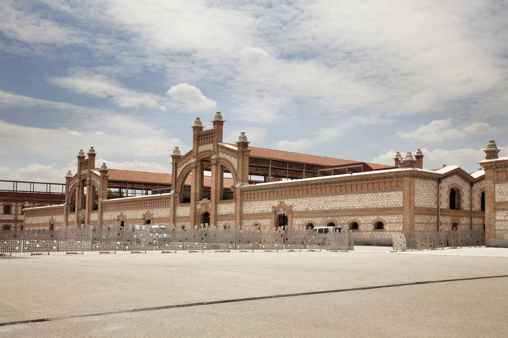

## Descripción
Adecuación y gestión del espacio Matadero de Madrid para desarrollar un programa limitado a una pequeña parte de la población. Desaprovechamiento de un espacio público para el encuentro cultural. Utilización privada de lo que se considera una de las nuevas fachadas de la ciudad. 

## Ejercicios
2007, 2008, 2009, 2010, 2011, 2012, 2013, 2014, 2015, 2016

## Distrito
Arganzuela, Todo Madrid

## Importe
         NA €

## Indicios políticos

## Indicios económicos
- Se contrató a una empresa privada para ejecutar el gasto cuando podría haberlo hecho el Ayuntamiento.

## Indicios de falta de transparencia y corrupción
- La población no fue informada suficientemente del gasto.
- La información relativa la gasto no es fácilmente accesible al público.

## Indicios sociales
- El gasto sólo beneficia a una minoría privilegiada de la población.

## Indicios ambientales

## Indicios de género
- No hubo evaluación de impacto de género antes de ejecutar el gasto.

## Indicios laborales

## Otros indicios
Matadero se define como un espacio generalista de intercambio de ideas sobre la cultura y los valores de la sociedad contemporánea, abierto a todos los campos de la creación, con el fin de favorecer el encuentro y el diálogo de los creadores entre sí y de éstos con el público.
Sin embargo las actividades que se desarrollan o bien están limitadas a un pequeño espectro de la población o bien se destinan a su aprovechamiento comercial. Mercantilización e infrautilización de un espacio público destinado al encuentro y la cultura. Alquiler de los espacios con fines comerciales.    
Modelo de gestión pública y privada entre cuyos fines está la viabilidad económica del proyecto.

## Pruebas
Memoria de actividades.

## Aspectos a investigar
Modelo de gestión. Contratos. Coste de mantenimiento. Acuerdos con empresas privadas.

## Correo

  
