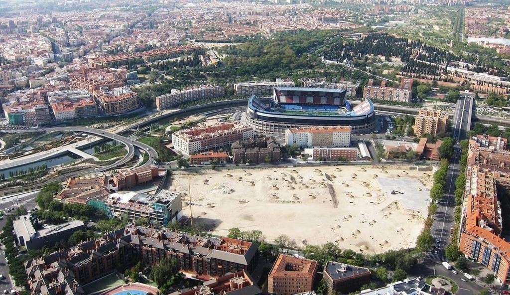

## Descripción
Convenio con Atlético de Madrid y Mahou para desarrollo del Proyecto Urbanístico

## Ejercicios
2007, 2008, 2009, 2010, 2011, 2012, 2013, 2014

## Distrito
Arganzuela

## Importe
         NA €

## Indicios políticos
- El gasto no estaba contemplado en el programa electoral.

## Indicios económicos

## Indicios de falta de transparencia y corrupción
- La información relativa la gasto no es fácilmente accesible al público.
- Hubo irregularidades en el proceso de contratación.

## Indicios sociales
- El gasto compromete la satisfación de algún derecho básico para alguna parte de la población.
- El gasto sólo beneficia a una minoría privilegiada de la población.
- En el barrio o distrito había otras necesidades prioritarias que podrían haberse financiado con el dinero que supuso el gasto.

## Indicios ambientales

## Indicios de género

## Indicios laborales

## Otros indicios

## Pruebas
Existe información sobre el pago del convenio con entradas de fútbol por parte del Atlético de Madrid y acuerdo perjudicial para el Consistorio que debería abonar 40% de la operación para infraestructura y urbanización con dinero público.

## Aspectos a investigar
Aplicación de convenio entre las partes y acuedo sobre el Plan Especial de Desarrollo Urbano del Proyecto

  
