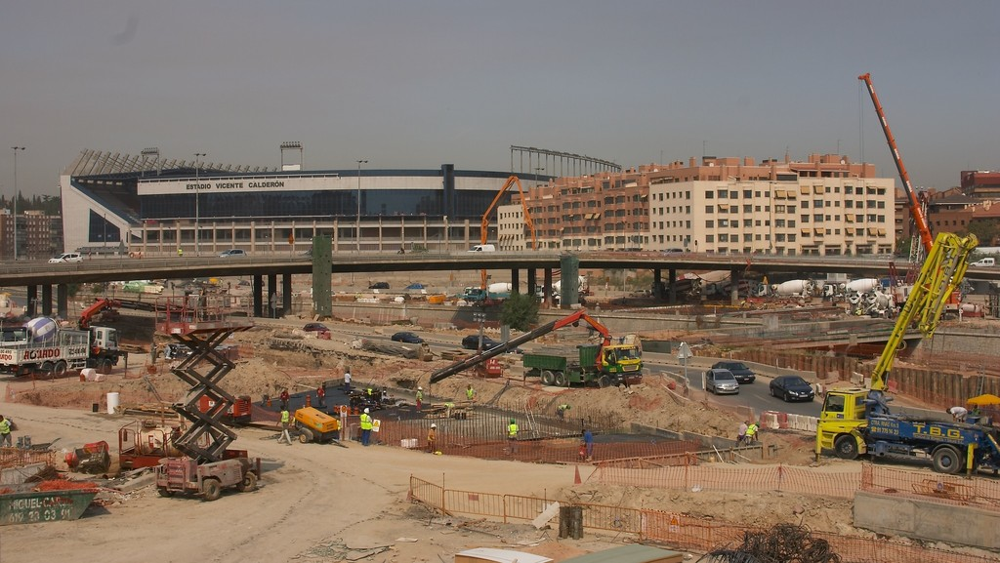

## Descripción
Soterramiento de la M-30 y mantenimiento de la infraestructura. 

## Ejercicios
2004, 2005, 2006, 2007

## Distrito
Todo Madrid

## Importe
         NA €

## Indicios políticos

## Indicios económicos
- El gasto ha tenido un sobrecoste superior al 20% de lo presupuestado.
- El Ayuntamiento tuvo que endeudarse para financiar el gasto.
- Las condiciones del crédito para financiar el gasto fueron abusivas.

## Indicios de falta de transparencia y corrupción
- La población no fue informada suficientemente del gasto.
- La información relativa la gasto no es fácilmente accesible al público.
- Hubo irregularidades en el proceso de contratación.
- Existen vínculos entre el equipo de gobierno que aprobó el gasto y la empresa o empresas adjudicatarias.

## Indicios sociales
- El gasto compromete la satisfación de algún derecho básico para alguna parte de la población.
- En el barrio o distrito había otras necesidades prioritarias que podrían haberse financiado con el dinero que supuso el gasto.

## Indicios ambientales
- No hubo evaluación de impacto ambiental antes de ejecutar el gasto.
- El gasto ha perjudicado la salud de una parte de la población.
- El gasto ha provocado una agresión a la biodiversidad (especies animales y vegetales).

## Indicios de género
- No hubo evaluación de impacto de género antes de ejecutar el gasto.
- En la ejecución del gasto han participado significativamente más hombres que mujeres.
- Existe discriminación de género en la empresa que ejecutó el gasto.

## Indicios laborales
- Las condiciones laborales de los trabajadores de la empresa que ejecutó el gasto son sensiblemente peores que la de los trabajadores públicos de la misma categoría.

## Otros indicios
El proyecto fue declarado nulo por el tribunal superior de justicia europeo por no realizar declaración de impacto ambiental. 

## Pruebas
Sentencia de nulidad del proyecto por el tribunal superior de justicia europeo.

## Aspectos a investigar
Contratos adjudicados.
Coste de mantenimiento de la Calle 30.

## Correo

  
